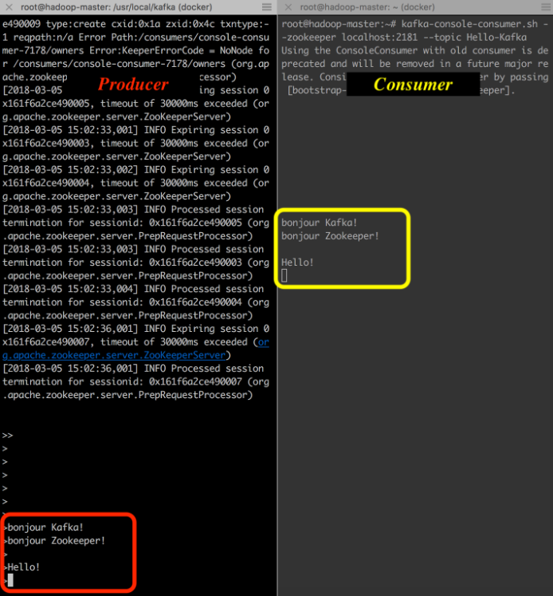

# TP - Introduction à Apache Kafka et au Streaming de Données

## Objectifs du TP
- S'introduire au système de messagerie et plateforme de streaming Kafka
- Utiliser Kafka comme source ou puits de données
- Comprendre le fonctionnement des producers et consumers Kafka

## Outils et Composants
* [Docker](https://www.docker.com/)
* [Apache Kafka](https://kafka.apache.org/)
* [Apache Zookeeper](https://zookeeper.apache.org/)
* [Jupyter Notebook](https://jupyter.org/) avec PySpark

## Architecture
L'image Docker fournie contient :
- Un Jupyter notebook avec PySpark pour l'analyse et le traitement des données en streaming
- Apache Zookeeper pour la coordination distribuée des nœuds (brokers) Kafka
- Apache Kafka comme plateforme de streaming distribué

## Instructions

### 1. Nettoyage de l'environnement Docker

1. Listez les conteneurs existants :
```bash
docker ps -a
```

2. Arrêtez et supprimez tous les conteneurs :

Sur Windows :
```bash
for /f "tokens=*" %i in ('docker ps -q') do docker stop %i
```
```bash
for /f "tokens=*" %i in ('docker ps -a -q') do docker rm %i
```

Sur Linux/Mac :
```bash
docker stop $(docker ps -q) && docker rm $(docker ps -a -q)
```

### 2. Installation et Configuration

1. Téléchargez le fichier docker-compose.yml depuis le [dépôt du TP5](https://github.com/ECE-BigDataCourse-M12024/big-data-course-materials/blob/master/docs/TP5/docker-compose.yml)

2. Dans un terminal, naviguez jusqu'à l'emplacement du fichier docker-compose.yml

3. Lancez l'environnement Docker :
```bash
docker compose up
```

#### Notes sur la configuration
- Un volume partagé '**streaming_data**' est créé pour la persistance des données
- Ports utilisés :
  - Jupyter notebook : 8888
  - Interface Spark : 4040
  - Zookeeper : 2181
  - Kafka : 9092

### 3. Configuration de Kafka

1. Créez un topic de test :
```bash
kafka-topics --create --topic test-topic \
  --bootstrap-server localhost:9092 \
  --bootstrap-server localhost:9092 \
  --partitions 1 \
  --replication-factor 1
```

2. Vérifiez la création du topic :
```bash
kafka-topics --list --bootstrap-server localhost:9092
```

3. Démarrez une console producer :
```bash
kafka-console-producer --topic test-topic \
  --bootstrap-server localhost:9092
# Après l'exécution, vous pouvez taper des messages
# Chaque ligne sera envoyée comme un message
```

4. Dans un nouveau terminal, démarrez une console consumer :
```bash
kafka-console-consumer --topic test-topic \
  --bootstrap-server localhost:9092 \
  --from-beginning
```

Le résultat devra ressembler à l'image suivante:



### 4. Exercice

Le but de l'exercice va être de créer un autre producer à partir d'un script python. 

1. Accédez à Jupyter Notebook sur localhost:8888

2. Importez les scripts Python du répertoire [utils](https://github.com/ECE-BigDataCourse-M12024/big-data-course-materials/tree/master/docs/TP5/utils) du TP5

3. Dans une console Jupyter, installez kafka-python :
```bash
pip install kafka-python
```

4. Modifiez le script 'post_to_kafka.py' pour publier sur le topic créé précédemment.

Pour tester, exécutez :
```bash
python post_to_kafka.py
```

Si vous voyez les messages apparaîtrent sur la console consumer, félicitations!!