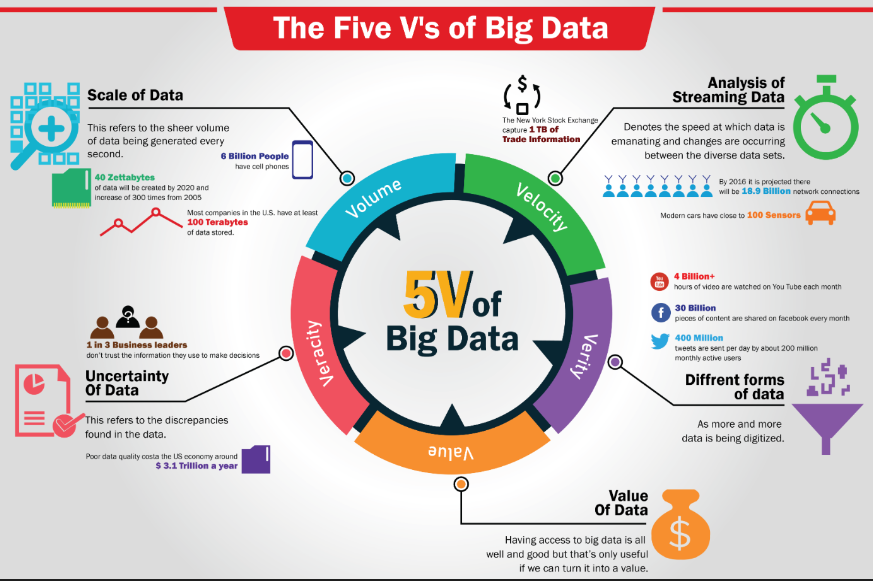

# 1. Introduction 

## 1.1) Définition et enjeux 

**Définition Big Data + Les 5 V du Big Data:** Volume, Vélocité, Variété, Véracité, Valeur

**Enjeux du Big Data**:
- "You can have data without information, but you can't have information without data"
- Opportunités et défis (maîtrise du cyle de la donnée; myopie (where is my data), défi lié à diversité organisationnelle des entreprises (différentes entités, geo::monde, timezone etc...), choix technos, disponibilité des ressources techniques, inertie & flexibilité du SI existant, sécurité de la donnée, confidentialité, règlementation etc...) pour les entreprises

**Exemples concrets d'applications:**
- Tout secteur où il y a de la donnée... (Ecommerce, santé, retail, banque, Media, Marketing, Luxe etc....)

**Cycle de vie de la donnée:**
- Acquisition > Ingestion/Integration > Traitement > Stockage/Exportation > Restitution (dashboard) &/ou Analyse prédictive (ML/DL/IA) 
La gouvernance de la donnée est la pratique de gestion du cycle de vie de ma donnée. 

**Outillage:**
A chaque étape du parcours de la donnée fait intervenir un/des outillage(s) spécifique(s).
On peut classer les outils de Big Data dans les familles suivantes: 
- Outils d'ingestion de données, ex: Airbyte, Kafka, Spark, Hudi, Ingestion connectors from DB, Fivetran
- Outils de stockage, ex: HDFS, HBase, Cassandra, Amazon s3, OracleDB, etc...
- Outils de traitement et d'analyse (dit processing), ex: Hadoop, Spark, Flink, AWS Glue, Databricks, dbt etc...
- Outils de visualisation, ex: Tableau, PowerBI, Qlik, Kibana etc...
- Outils de traitement ML/AI, ex: SparkML, H2O.ai, DataRobot, MLflow, Kubeflow etc...
- Outils de gouvernance, ex: Apache Ranger, Collibra, Atlan etc...

## 1.2) Concepts clés
**Concepts généraux:**
- [ ] source code, bytecode, machine code + JVM (cross-platform runtime engine that can execute instructions compiled into Java bytecode)

- [ ] fiabilité; scalabilité; maintenabilité 

**Stockage:**
[ ] Partitionnement

**Traitement (processing):**

[ ] Diff. entre: single machine computing (multitasks vs multicore parallelism); vertical scaling vs horizontal scaling; cloud computing & distributed computing

**Transport de la donnée:**
- [ ] Encodage et format
- [ ] Serialization 
- [ ] Replication
- [ ] Routage (lors du transfert de la donnée au sein d'un cluster) & data locality (local area network etc..)