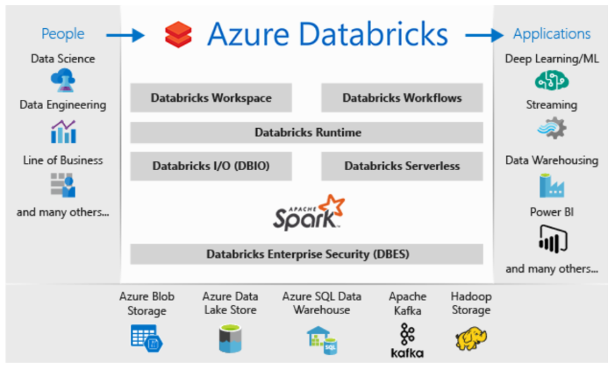
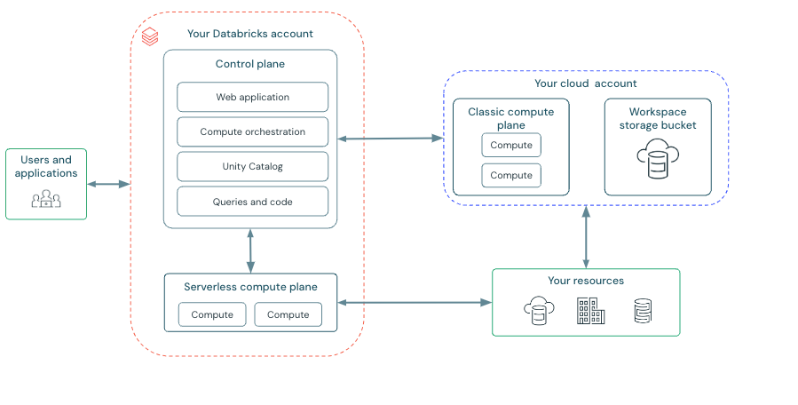
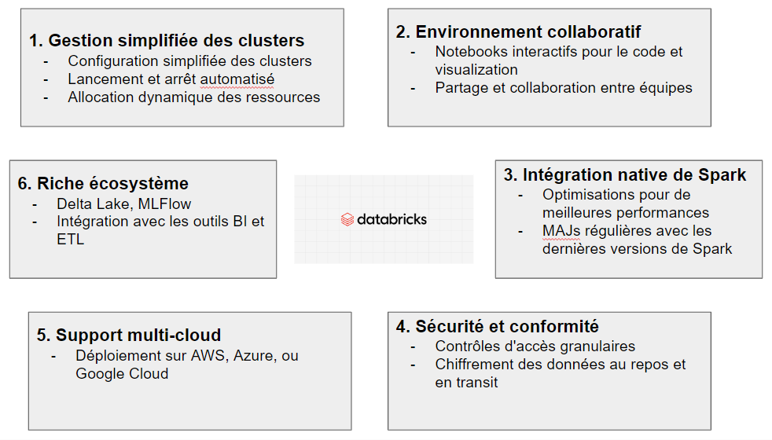

# 1. PySpark

### 1.1 Définition et intérêt

#### Qu'est-ce que PySpark ? 📌

PySpark est à la fois une bibliothèque Python et une API (Interface de Programmation d'Application) pour Apache Spark. 

1. **PySpark en tant que bibliothèque :**
   - C'est une bibliothèque Python installable via pip : `pip install pyspark`
   - Elle offre des modules et fonctions pour interagir avec Spark depuis Python

2. **PySpark en tant qu'API :**
   - Fournit une interface Python pour Apache Spark
   - Permet d'accéder aux fonctionnalités de Spark de manière programmatique
   - l'équivalent de l'API Scala de Spark, mais adaptée au style Python

3. **Caractéristiques clés :**
   - Agit comme une enveloppe autour du noyau Java/Scala de Spark
   - Donne accès aux principales fonctionnalités de Spark : SQL, DataFrames, Structured Streaming, MLlib, GraphX
   - S'intègre avec d'autres bibliothèques Python comme NumPy et Pandas

4. **Utilisation :**
   ```python
   from pyspark.sql import SparkSession
   spark = SparkSession.builder.appName("MonApp").getOrCreate()
   ```

#### Intérêt de PySpark ?

1. **Facilité d'apprentissage :** Basé sur Python, un langage polyvalent et très répandu
2. **Scalabilité :** Permet le traitement distribué de données massives
3. **Polyvalence :** Permet de s'appuyer d'autres concepts et librairies Python pour le traitement distribué


# 2. Databricks

### 2.1 Qu'est-ce que Databricks ?

Databricks est une plateforme unifiée d'analyse de données et d'IA
Fondée par les créateurs d'Apache Spark. Elle offre un environnement collaboratif, un espace de travail partagé grâce auquel plusieurs types d'employés peuvent collaborer sur des tâches lié au Big Data ou ML/DL.



L'utilisateur dispose d'un compte, d'un rôle (auquel est associé des droits) et d'un espace de travail.


### 2.2 Avantages de Databricks




---
Pour aller plus loin:
- https://community.cloud.databricks.com/
- https://learn.microsoft.com/fr-fr/training/paths/data-engineer-azure-databricks/