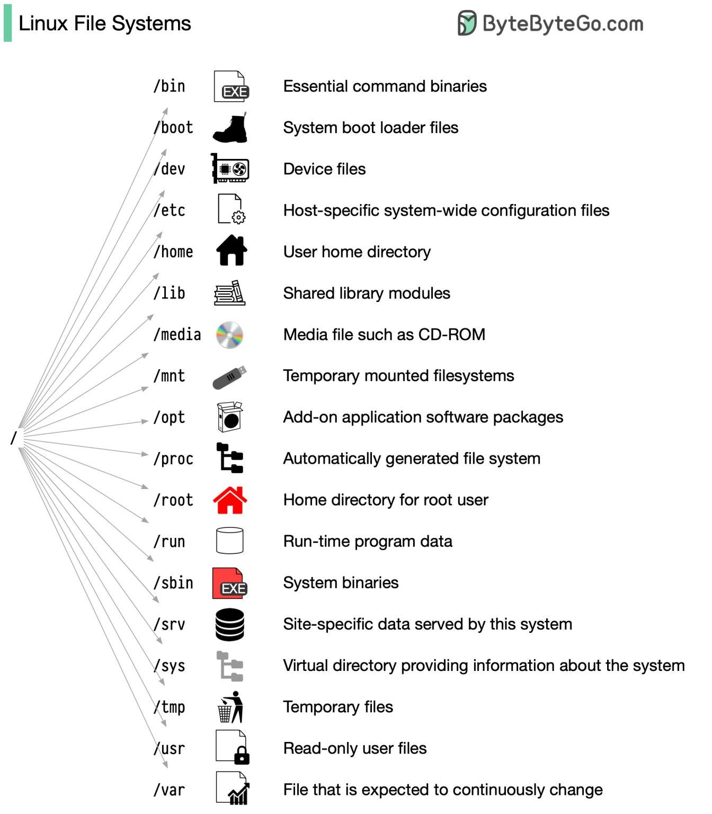

# Cours : SGBD et structure de données pour le Big Data

# 1. Introduction

### Définitions:

- **Base de données (BDD)** : Collection organisée de données structurées.
  >Imaginez-la comme une bibliothèque numérique où chaque livre (donnée) est classé selon un système précis pour faciliter sa recherche et son utilisation
  
- **Système de Gestion de Base de Données (SGBD)** : Logiciel permettant de gérer, interroger et maintenir les bases de données.
  Exemples de SGBD: MySQL, PostgreSQL, Oracle, Microsoft SQL Server ...
  >C'est comme le bibliothécaire de notre bibliothèque numérique. Il organise les données, gère les accès, assure la cohérence et la sécurité des informations.
  
### Types de bases de données
- **BDD Relationnelles**: organisées en tables avec des relations entre elles, elles utilisent généralement le langage SQL, et sont conçues pour **respecter les propriétés ACID** (Atomicité, Consistence, Isolation, Durabilité), offrant une structure rigide adaptée aux données structurées.
- **BDD Non-relationnelles**: appelées NoSQL, elles proposent **divers modèles de données** flexibles (clé-valeur, document, colonne, graphe) adaptés aux données **non structurées ou semi-structurées**, sacrifiant parfois certaines garanties ACID au profit de la **scalabilité et de la flexibilité**.


# 2. Rappels

### OLAP vs OLTP 

Le traitement analytique en ligne (OLAP) et le traitement transactionnel en ligne (OLTP) sont **deux systèmes de traitement de données différents conçus à des fins différentes** . 

- (un système) OLTP (Online Transaction Processing) est optimisé pour le traitement transactionnel et les mises à jour en temps réel. Ce type de système de traitement est au cœur des transactions numériques quotidiennes, alimentant des systèmes tels que les distributeurs automatiques de billets, les services bancaires en ligne, les caisses enregistreuses ou encore les plateformes de commerce électronique. Il représente la **base de données opérationnelle** ou la base de données d'une application, en utilisant un **modèle relationnel** (des objets appelés "entités" qui sont reliés entre eux), souvent avec une structure normalisée évitant la redondance et assurant la consistance des données.
  
  Ex: illustration d'un modèle de donnée relationnel
>


- Les systèmes OLAP (Online Analytical Processing) permettent l'analyse complexe de grandes quantités de données en utilisant une modélisation multidimensionnelle pour l'analyse, où les données sont organisées en cubes OLAP composés de **faits** (mesures numériques) et de **dimensions** (contextes d'analyse), souvent avec une structure dénormalisée pour optimiser les performances des requêtes analytiques.


Comparaison:


Les systèmes de stockages de données tel que: 'data warehouse' et 'datamart' sont de type OLAP, tandis que les 'database' sont de type OLTP. 

> Leur rappeller que dans le cadre de leur projet de groupe, il n'est pas nécessaire pour la visualization de s'appuyer sur un datawarehouse, une bdd ou même un fichier csv/excel/json suffit. 


# 3. Architecture et performance 

### 3.1) Cache, Memory, Disk

##### 3.1.1) Cache:  
C'est le **type de stockage de données le plus rapide et le plus petit**. Il est utilisé pour stocker les données qui sont en cours de traitement ou qui sont en file d’attente pour être traitées. Il peut aussi être utilisé afin de conserver temporairement des données **fréquemment consultées**, réduisant ainsi les temps d'accès et améliorant les performances.
Les caches existent à plusieurs niveaux: 
- CPU cache 
- RAM cache
- Disk cache
Ils servent à rechercher rapidement des données au lieu d'accéder à des supports de stockage plus lents tels que la mémoire vive ou les disques.
Généralement lorsqu'on parle de cache on se réfère au CPU cache (en fonction du contexte).

##### 3.1.2) Mémoire vive (RAM): 
**Type de mémoire volatile** utilisé par les ordinateurs pour stocker les données et les instructions en cours d'utilisation ou de traitement. 
Elle permet un accès rapide à la lecture et à l'écriture, ce qui permet à l'unité centrale (CPU) de récupérer rapidement les informations. 
A noter que les données contenues dans la RAM sont perdues lorsque l'ordinateur est mis hors tension.

##### 3.1.3) Disque dur (SSD, HDD):
**support de stockage non volatil** utilisé pour stocker les données, les fichiers et les applications sur un ordinateur. Ils offrent une plus grande capacité de stockage que la RAM et conservent les données même lorsque l'ordinateur est éteint, ce qui les rend adaptés au stockage de données à long terme.


>Nb: Il existe aussi un autre type d'espace mémoire appelé 'ROM' (Read Only Memory). 
>Il est principalement utilisée pour stocker les microprogrammes dont le système a besoin pour démarrer et fonctionner (ex: BIOS/UFI).

Tableau de comparaison: 

| Feature                 | **CPU Cache**                             | **Memory (RAM)**                                        | **Disk Storage**                                             |
| ----------------------- | ----------------------------------------- | ------------------------------------------------------- | ------------------------------------------------------------ |
| **Purpose**                 | Speeds up CPU data access                 | Temporary storage for active data and programs          | Permanent storage for data and files                         |
| **Location**        | Inside the CPU (L1, L2, L3 caches)        | Separate from the CPU, on the motherboard               | On hard drives (HDD) or solid-state drives (SSD)             |
| **Speed**             | Extremely fast (nanoseconds)              | Fast (microseconds)                                     | Slow (milliseconds to seconds)                               |
| **Size**              | Small (typically a few MBs)               | Moderate (a few GBs to hundreds of GBs)                 | Large (hundreds of GBs to several TBs)                       |
| **Volatility**          | Volatile (data lost when power is off)    | Volatile (data lost when power is off)                  | Non-volatile (data retained when power is off)               |
| **Cost**                | Most expensive per GB                     | Moderate cost per GB                                    | Least expensive per GB                                       |
| **Accessibility**       | Frequently accessed data and instructions | Active data for running applications                    | Infrequently accessed data, files, and backups               |
| **Data Management** | Managed by the CPU                        | Managed by the OS and applications                      | Managed by the OS and file systems                           |
| **Hierarchy**          | Has multiple levels (L1, L2, L3)          | No hierarchy, but may have different types (DDR4, DDR5) | Usually one level, but can have different formats (HDD, SSD) |
| **Usage context**    | Accessed during CPU processing cycles     | Used during program execution                           | Used for long-term data storage                              |

Chaque cœur de processeur possède sa propre mémoire cache (L1 et L2 pour être précis). Le cache L3 est partagé entre les différents cœurs CPU. 


Par CPU:


### 3.2) Structure de données au coeur des BDDs

Les index, les hachages et les arbres sont des structures de données utilisées dans les bases de données pour optimiser l'accès et la récupération des données. 

##### 3.2.1) Indexes
Concept et structures de données permettant d'optimiser la recherche d'enregistrement dans une base de donnée. Un index peut être crée via diverses structures de données, le plus souvent via des tables de hachages ou des B-Trees (cf ce qui suit). 


Il est généralement stocké dans un format clé-valeur où la clé est le champ ou la colonne (trié) et la valeur est le(s) pointeur(s).
Ex: John Smith -> 152; Lisa Smith -> 001

Pensez à l'index d'un livre : au lieu de parcourir chaque page pour trouver une information, on consulte l'index pour aller directement à la bonne page.
Il est donc plus facile de retrouver une information en parcourant l'index que la table. 

Utilisez des index sur :
1. Les colonnes fréquemment utilisées dans les clauses WHERE
2. Les colonnes impliquées dans les jointures (clés étrangères)
3. Les colonnes souvent utilisées pour le tri (ORDER BY)
4. Les colonnes avec une grande cardinalité (nombreuses valeurs uniques)

Nb: Les index peuvent aussi être crée à partir de plusieurs colonnes, à la création ou après que la table soit créée. 

```sql
CREATE INDEX idx_first_name ON employees (first_name); --single column
CREATE INDEX idx_name ON employees (last_name, first_name); --multiple columns


-- Utilisation implicite de l'index dans une requête 
SELECT * FROM employees WHERE first_name = 'Alice';
```

>Attention: le gain en lecture et pour certaines opérations a un coût. 
>- consommation accrue de stockage: il faut bien stocker la table d'index
>- durée lors des opérations d'écriture (create or update): car il faut aussi  mettre à jour la table d'index
>- complexité de management: bien gérer le nombre d'index et s'assurer qu'ils répondent bien aux besoins


##### 3.2.2) Hash 
Les fonctions de hachage font correspondre des données de taille arbitraire à des valeurs de taille fixe. Les plus connus sont: SHA-256, SHA-251, BLAKE2.
Le hash sera le résultat de l'application de la fonction de hachage sur une entrée. 
Cette entrée peut être un du texte, une image, toute donnée. Elle manipule donc la représentation binaire de ces divers éléments. 


En base de donnée, les tables de hachages sont généralement utilisées pour créer des indexes.
 


Utilisez ce type d'index idéalement pour:
- Pour des requêtes à correspondance exacte
- Example: `SELECT * FROM users WHERE id = 1234`


##### 3.2.3) Arbres (Trees)

En informatique les arbres sont des type de données abstraites assez répandues. Ils représentent la donnée sous une structure arborescente hiérarchique avec un ensemble de nœuds connectés. Chaque nœud de l'arbre peut être connecté à de nombreux enfants (en fonction du type d'arbre), mais doit être connecté à un seul parent, à l'exception du nœud racine ('root' node), qui n'a pas de parent.

En base de données, un type d'arbre est souvent utilisée pour **l'indexation des données**: B-tree.  Les arbres B sont des structures de données arborescentes auto-équilibrées (ie qui équilibre automatiquement la répartition des nœuds, afin de conserver un équilibre à chaque niveau de l'arbre) qui conservent des **données triées et permettent des opérations d'insertion, de suppression et de recherche efficaces**. 

Illustrations avec des nombres:


Illustration avec des lettres:


Utilisez ce type d'index quand: 
- vous utilisez des requêtes de sélection de plage ou de tri
- Exemple: `SELECT * FROM users WHERE age BETWEEN 20 AND 30`

Dans le cas des indexes type B-Tree, l'écriture est assez coûteuse, en effet une insertion ou mise à jour nécessite de recréer l'arbre afin de respecter son "équilibre". D'autres types d'arbres pour l'indexation existent, on citera notamment: B+ Tree, et LSM-Tree.

A noter que lorsque vous effectuer la commande: "CREATE INDEX" très souvent le type d'indexe crée est un B-Tree. Mais ce n'est pas tout le temps cas!
Certains SGBD comme PostgreSQL permettent d'avoir une approche hybride en offrant la possibilité de créer des index via fonctions de hachage et arbres (B-Trees). Bénéficiant ainsi des avantages de chacune des approches, mais comme on l'a vu cela augmentera la complexité de la gestion des index mais aussi le coût des opérations d'écritures. 


# 4. Systèmes de stockage de données 

### 4.1) Différents systèmes 
##### Database 
Une **base de données** est une **collection structurée** de données organisées en **tableaux**, **lignes** et **colonnes**. Elle est spécifiquement conçue pour **stocker** et **gérer** les données relatives à des applications ou services.

##### Data Warehouse
Un **data warehouse** (entrepôt de données) est un référentiel centralisé conçu pour **stocker**, **traiter** et **analyser** de grands volumes de **données structurées.** Il regroupe généralement des données provenant de sources multiples et prend en charge des requêtes et des analyses complexes.


##### Datamart
Un **data mart** est un **sous-ensemble** d'un **data warehouse**, souvent axé sur un **secteur d'activité spécifique**, **département** ou **fonction**. Il est adapté aux besoins d'un groupe particulier d'utilisateurs au sein d'une organisation.

##### Datalake
Datalake ou lac de données en français, est un **référentiel centralisé** qui stocke des données structurées et non structurées à grande échelle, **dans leur format natif**.
Il englobe les données:
- structurées, 
- semi-structurées (JSON, XML) 
- et non structurées (texte, images, vidéos).

Caractéristiques :
- Utilise la logique ELT (Extraction, Chargement, Transformation) plutôt que ETL traditionnel. La transformation des données s'effectuant donc après l'extraction et le dépôt sur le data lake. 
- Supporte la virtualisation des données pour un accès unifié.
  La virtualisation des données crée une couche d'abstraction au-dessus des différentes sources de données dans le lac. Cette couche permet d'accéder à toutes les données comme si elles étaient dans une seule base de données unifiée, quel que soit leur format ou leur emplacement réel. (Ex: Apache Drill, Trino, Denodo, Hive...)
  
  >

- Intègre souvent un catalogue de données pour la gouvernance et la découverte des données. 
- Utilise des formats de table spécifiques (comme Delta Lake) offrant des fonctionnalités similaires aux bases de données sur des fichiers distribués.
  
  


### 4.2) Comparaison


# 5. Système de fichiers (File systems)

### Definition: 
Un **système de fichiers** est une méthode et une structure de données utilisées par les systèmes d'exploitation pour gérer et organiser les fichiers sur les périphériques de stockage (tels que les disques durs, les disques SSD, les clés USB, etc.). Il définit la manière dont les données sont stockées, récupérées et organisées, ce qui permet aux utilisateurs et aux applications d'accéder aux fichiers et de les manipuler efficacement. En principe, tout système de fichiers peut stocker n'importe quel format de fichier. Pour le système de fichiers, tous les fichiers ne sont que des séquences d'octets.

Il est composé de :
- fichiers
- dossiers ou répertoires
- métadonnées de fichiers (type, date, taille, droits etc...)
- chemins d'accès aux fichiers (filepath, ex: C://Users/Documents/MyFolder)

Exemple: Linux file systems

Il permet aux utilisateurs et aux applications de stocker, d'extraire et de gérer efficacement les fichiers. 

Dans le contexte du Big Data, les systèmes de fichiers traditionnels ne suffisent plus, car nous sommes dans un paradigme distribué. Plusieurs solutions ont été développées pour répondre aux besoins spécifiques du stockage et du traitement de grandes quantités de données.

### Exemples de file systems:
- **HDFS (Hadoop Distributed File System)**:
	- Partie intégrante de l'écosystème Hadoop
	- Caractéristiques :
	    - Distribué : les données sont réparties sur plusieurs nœuds
	    - Hautement tolérant aux pannes : réplication des données
	    - Optimisé pour les grands fichiers et le streaming de données

- **DBFS (Databricks File System)**:
	- Système de fichiers **abstrait** utilisé dans Databricks. Il permet d'accéder à différents types de fichiers (.png, .csv, .parquet, .orc etc...), situés à divers endroits (espace de travail, cache, HDFS, BDD relationnelles/non-relationnelles). Il permet aussi d'implémenter des politiques et controles d'accès aux fichiers.
	- Caractéristiques :
	    - Compatible HDFS
	    - Intégration transparente avec le cloud (AWS S3, Azure Blob Storage, etc.)
	    - Optimisé pour les workloads Spark
	- Concepts:
		- Mount: un objet qui sert de point d'accès facile à un système de stockage externe dans notre environnement Databricks. Lorsque vous créez un montage (mount), vous dites à Databricks : «Lorsque je fais référence à ce chemin dans DBFS, je veux en fait accéder à cet emplacement de stockage externe spécifique».
		- Root: le répertoire "racine" permettant d'importer des fichiers ou créer des dossiers dans notre espace de travail
		- Ephemeral storage:  Le stockage éphémère est le stockage temporaire disponible sur les machines virtuelles au sein d'un cluster. Les données écrites dessus (mis en cache) disparaisse une fois le cluster éteint ou mis en arrêt.

- Cloud file systems:
	- ADLS (Azure Data Lake Systems Gen2): 
		```text
		abfs://mycontainer@mystorageaccount.dfs.core.windows.net/folder/file.csv
		```

	- Amazon S3
		```text
		s3a://my-bucket/folder/file.csv
		```

	- Google  Cloud storage
		```text
		gs://my-bucket/folder/file.csv
		```


# 6. Formats
Les formats de fichiers définissent la manière dont les données sont structurées dans un fichier (par exemple, CSV, Parquet, JSON). C'est à l'application qui lit le fichier de comprendre et d'interpréter son format.

En big data les formats de fichiers jouent un rôle crucial dans le stockage, le traitement et l'analyse des données. Des formats tels que Parquet, ORC et Avro sont conçus pour traiter efficacement de grands volumes de données dans les environnements big data. Il est essentiel de comprendre ces formats pour optimiser les flux de données, garantir l'intégrité des données et maximiser la vitesse de traitement.


Certainly! I'll create a simplified comparison table focusing on Avro, ORC, and Parquet, highlighting their key characteristics, perks, and when to use each format.


##### Comparaison des principaux formats: Avro, Orc et Parquet:

| Feature          | Avro                     | ORC                      | Parquet                 |
|------------------|--------------------------|--------------------------|-------------------------|
| Type             | Row-based                | Columnar                 | Columnar                |
| Compression      | Good                     | Excellent                | Excellent               |
| Read Performance | Good                     | Very High                | Very High               |
| Write Performance| Very Good                | Good                     | Moderate                |
| Schema Evolution | Excellent                | Good                     | Good                    |
| Splittable       | Yes                      | Yes                      | Yes                     |
| Language Support | Many languages           | Primarily Java           | Many languages          |
| Key Perk         | Flexible schema evolution| Fast for Hive queries    | Efficient for analytics |
| When to Use      | - Data serialization     | - Hive-based analytics   | - General analytics     |
|                  | - Frequent schema changes| - Fast HDFS integration  | - Data warehousing      |
|                  | - Write-heavy workloads  | - Read-heavy workloads   | - Read-heavy workloads  |
| Best For         | Streaming data, ETL      | Hive queries, HDFS       | General analytics       |
| Ecosystem Fit    | Kafka, Hadoop            | Hadoop, especially Hive  | Spark, general Big Data |

##### Quand choisir quel format ?
- **Avro**: si vous avez besoin d'une évolution flexible des schémas ou si vous traitez des données en continu.
- **ORC**: si vous travaillez principalement avec Hive dans un environnement Hadoop.
- **Parquet**: pour l'analyse générale, en particulier si vous utilisez Spark ou si vous avez besoin d'un format qui fonctionne bien avec différents outils Big Data.


---
Sources:
- https://www.linkedin.com/pulse/differences-between-database-vs-data-warehouse-mart-lake-nguyen-tuan-ejo7c/
- https://www.ssp.sh/blog/data-warehouse-vs-data-lake-etl-vs-elt/
- https://www.ssp.sh/brain/data-lake-file-formats/
- https://blog.bytebytego.com/p/ep63-linux-file-system-explained