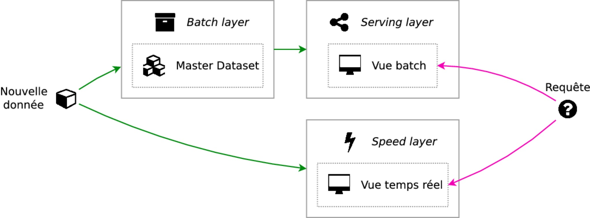
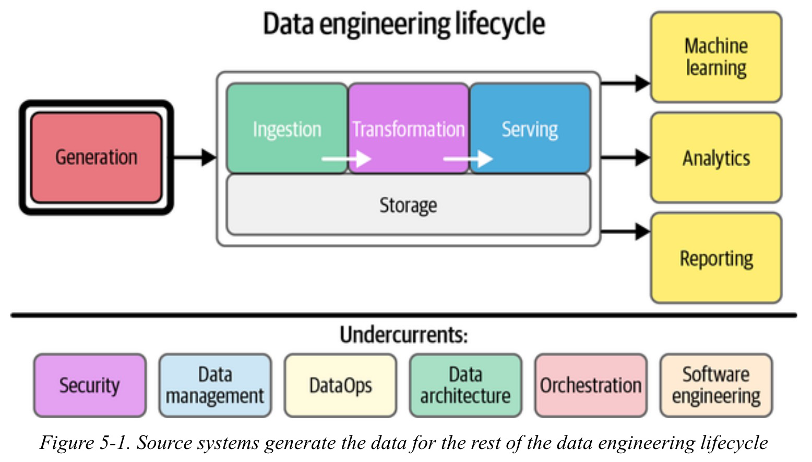
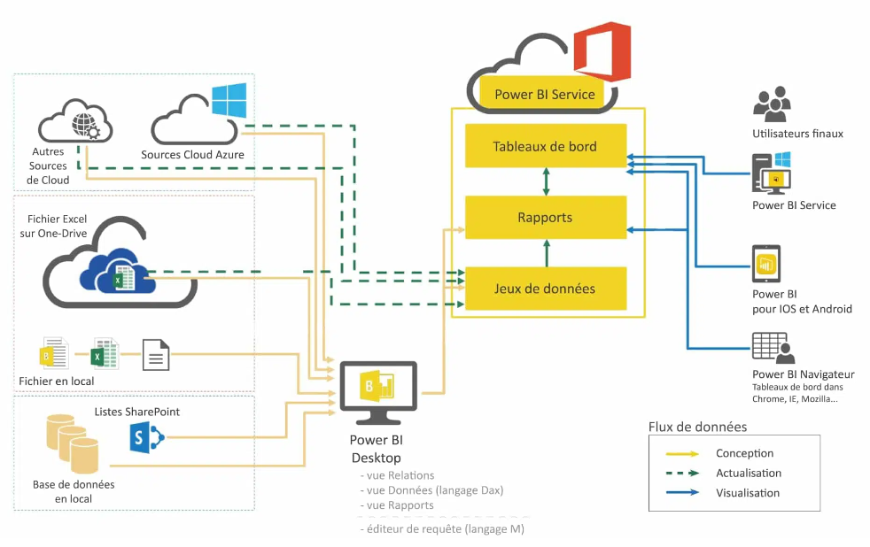
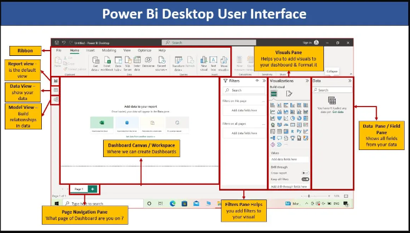
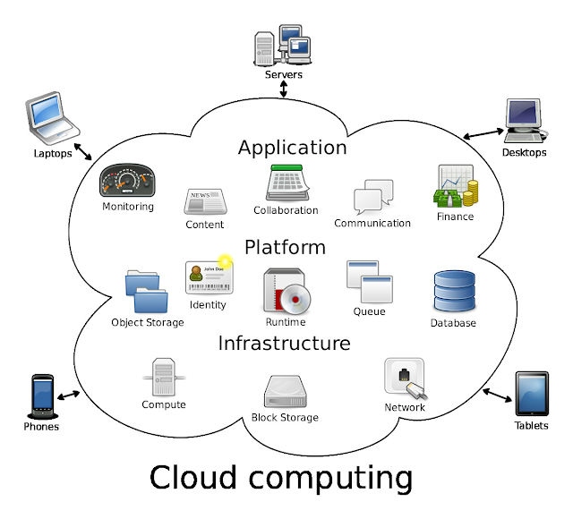
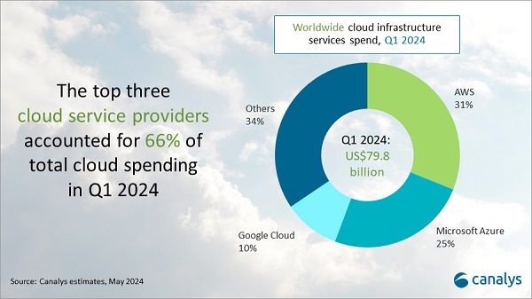
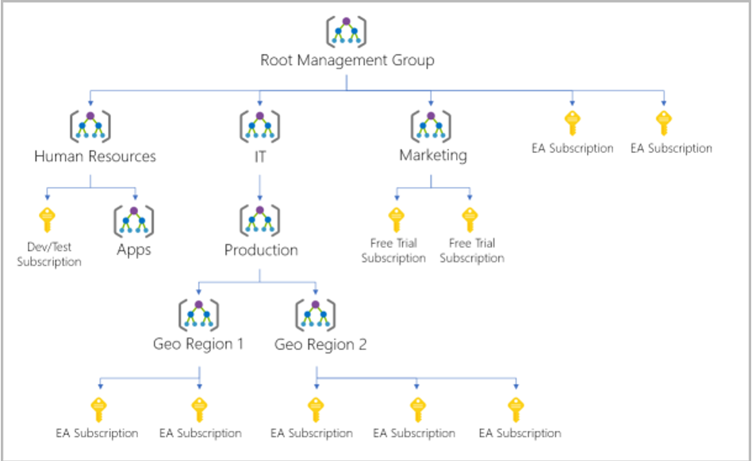
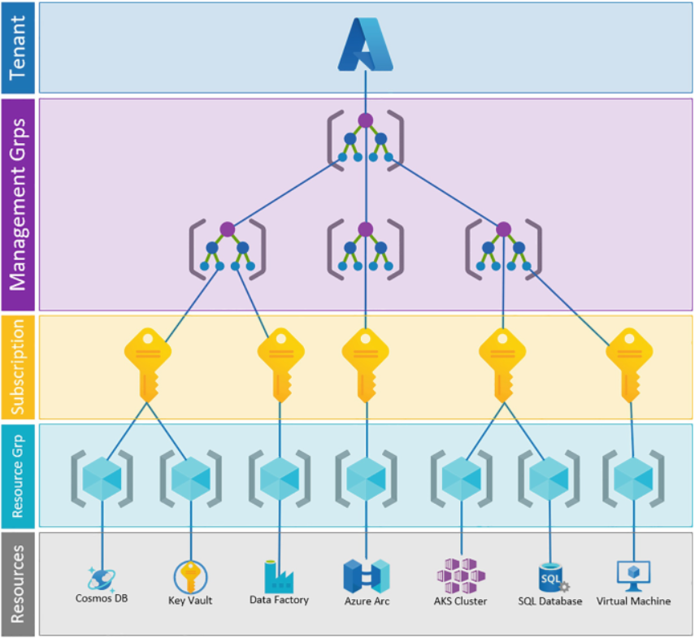
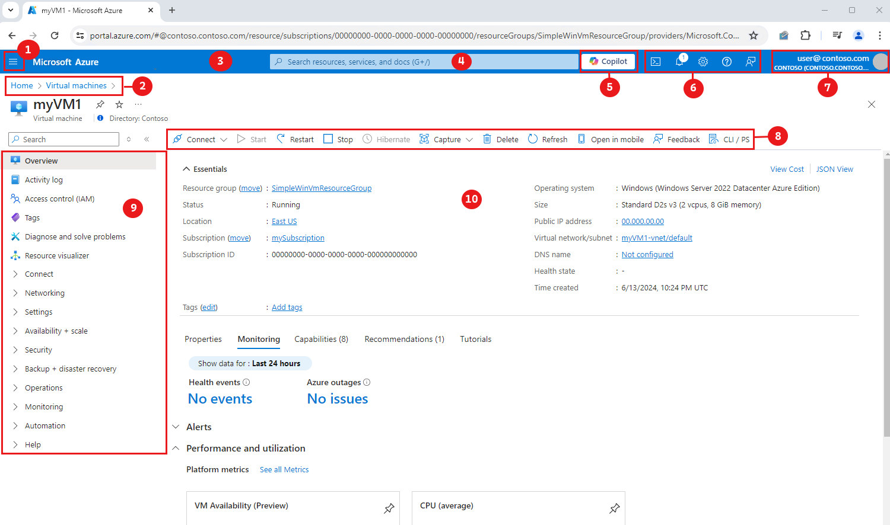
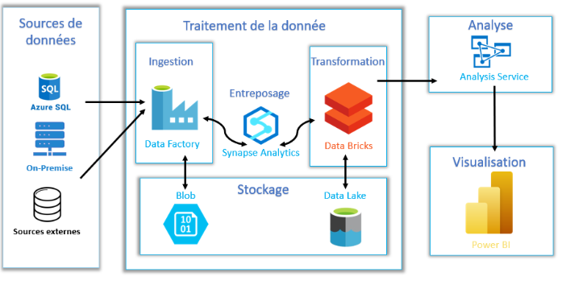

# Cours : Architecture, Datavisualization & Cloud

# 1. Architectures Big Data 📌

L'architecture des données décrit comment les données sont traitées, stockées et utilisées dans un système d'information. Dans le cadre du Big Data, la volumétrie, vélocité, variété des données nous poussent à développer de nouvelles architectures répondant à ses nouveaux besoins. 

Mais avant de vous présenter les 3 architectures suivantes, nous devons comprendre les notions de 'layers' (couches en Français). Chaque architecture s'appuiera sur une ou plusieurs couches en fonction des besoins du SI (Système d'Information) développé. 

- Batch Layer (Couche de traitement par lots): 
	- Stocke l'ensemble des données brutes
	- Effectue des traitements périodiques sur l'ensemble des données
	- Génère des vues préalablement calculées (batch views)

- Speed Layer (Couche de vitesse): 
     - Traite les données en temps réel
     - Compense le délai du traitement par lots
     - Génère des vues en temps réel qui complètent les batch views
       
- Serving Layer (Couche de service): 
     - Indexe et expose les batch views pour des requêtes à faible latence
     - Permet l'accès rapide aux résultats préalablement calculés


### 1.1) Lambda architecture

C'est un modèle de traitement des big data conçu pour trouver un équilibre entre une faible latence, un débit élevé et une tolérance aux pannes. 
Ce type d'architecture utilise une combinaison de traitement par lots pour créer des vues précises de grands ensembles de données et de traitement de flux en temps réel pour fournir des vues de données en direct. Les résultats des deux ensembles peuvent ensuite être fusionnés et présentés ensemble.

-*architecture lambda*-


Exemples: 

| **Systèmes de <br>recommandation <br>e-commerce**                                                                                                                                                                                                                                                                                                | **Plateforme de détection de fraude bancaire**                                                                                                                                                                                                                                           | **Systèmes de gestion du trafic urbain**                                                                                                                                                                                                                                                                                  | **Plateforme d'analyse de médias sociaux**                                                                                                                                                                                                                                              |
| ------------------------------------------------------------------------------------------------------------------------------------------------------------------------------------------------------------------------------------------------------------------------------------------------------------------------------------------------ | ---------------------------------------------------------------------------------------------------------------------------------------------------------------------------------------------------------------------------------------------------------------------------------------- | ------------------------------------------------------------------------------------------------------------------------------------------------------------------------------------------------------------------------------------------------------------------------------------------------------------------------- | --------------------------------------------------------------------------------------------------------------------------------------------------------------------------------------------------------------------------------------------------------------------------------------- |
| - **Batch Layer** : Analyse historique des comportements d'achat pour créer des modèles de recommandation.<br><br><br><br>- **Speed Layer** : Mise à jour en temps réel des recommandations basées sur l'activité de navigation actuelle.<br><br><br><br>- **Serving Layer** : Présentation des recommandations personnalisées aux utilisateurs. | - **Batch Layer** : Analyse approfondie des transactions historiques pour identifier des modèles de fraude.<br><br>- **Speed Layer** : Détection en temps réel d'activités suspectes sur les comptes.<br><br><br>- **Serving Layer** : Alertes et rapports pour les équipes de sécurité. | - **Batch Layer** : Analyse des tendances de trafic historiques pour la planification urbaine.<br><br>- **Speed Layer** : Ajustement en temps réel des feux de circulation basé sur les conditions actuelles.<br><br>- **Serving Layer** : Tableau de bord pour les opérateurs de trafic et informations aux conducteurs. | - **Batch Layer** : Analyse approfondie des tendances et sentiments sur de longues périodes.<br><br><br>- **Speed Layer** : Détection en temps réel des sujets tendance et des viral posts.<br><br><br><br>- **Serving Layer** : Rapports et visualisations pour les équipes marketing. |

L'architecture **Lambda** est souvent préférée lorsque :
- Il y a un besoin distinct de traitement par lots pour des analyses approfondies.
- La complexité du traitement en temps réel et par lots diffère significativement.
- La précision des résultats batch est cruciale pour certaines décisions métier.


### 1.2) Kappa architecture
L'architecture Kappa est un modèle de traitement des big data qui a historiquement divergé de Lambda. Elle repose sur le traitement de toutes les données entrantes comme un flux, et ne contient donc pas de couche de traitement par lots, s'appuyant uniquement sur une couche de traitement par flux (« couche de vitesse »).

-*architecture kappa*-


Exemples:

| **Plateforme de streaming vidéo en direct**                                                                                                                                                                                                                             | **Système de tarification dynamique pour le covoiturage**                                                                                                                                                                            | **Plateforme IoT pour la maintenance prédictive**                                                                                                                                                                                                 | **Système de trading algorithmique**                                                                                                                                                                                                |
| ----------------------------------------------------------------------------------------------------------------------------------------------------------------------------------------------------------------------------------------------------------------------- | ------------------------------------------------------------------------------------------------------------------------------------------------------------------------------------------------------------------------------------ | ------------------------------------------------------------------------------------------------------------------------------------------------------------------------------------------------------------------------------------------------- | ----------------------------------------------------------------------------------------------------------------------------------------------------------------------------------------------------------------------------------- |
| - **Speed Processing** : Traitement en continu des flux vidéo, des interactions des utilisateurs et des métriques de qualité.<br><br><br><br><br><br>- **Serving Layer** : Recommandations en temps réel, ajustement de la qualité du streaming, et analyse d'audience. | - **Speed Processing** : Analyse continue de la demande, de l'offre, des conditions de trafic et des événements locaux.<br><br><br>- **Serving Layer** : Mise à jour en temps réel des tarifs pour les conducteurs et les passagers. | - **Speed Processing** : Analyse en continu des données de capteurs pour détecter les anomalies et prédire les pannes.<br><br><br><br>- **Serving Layer** : Alertes en temps réel et planification de la maintenance pour les équipes techniques. | - **Speed Processing** : Analyse en continu des données de marché, des nouvelles financières et des indicateurs économiques.<br><br><br>- **Serving Layer** : Exécution automatique des ordres et tableau de bord pour les traders. |

L'architecture **Kappa** est généralement choisi quand :
- Les données peuvent être naturellement modélisées comme un flux d'événements.
- La simplicité de maintenance et de déploiement est une priorité.
- Les exigences de traitement en temps réel et par lots sont similaires.


### 1.3) Medaillon architecture

Une architecture en médaillon est un modèle de conception de données, inventé par Databricks, utilisé pour organiser logiquement les données dans un data lake.
L'idée est d'améliorer progressivement la qualité des données au fur et à mesure qu'elles circulent à travers les différentes couches.

Cette architecture se compose de trois couches distinctes 
- **Bronze (Raw)**:
   - Données brutes ingérées telles quelles
   - Pas ou peu de transformation
   - Sert d'archive et de point de départ pour le retraitement

- **Silver (Cleansed and Conformed)**:
   - Données nettoyées et validées
   - Schémas appliqués et métadonnées ajoutées
   - Peut inclure des jointures entre différentes sources

- **Gold (Curated Business-Level)**:
   - Données agrégées et/ou résumées
   - Optimisées pour l'analyse et la consommation
   - Souvent organisées par domaine métier ou cas d'utilisation
   
Chacune représentant des niveaux de qualité progressivement plus élevés. Les architectures en médaillon sont parfois appelées architectures « multi-hop ».

-*architecture medallion*-


La Medallion Architecture est particulièrement adaptée aux organisations qui cherchent à mettre en place une **stratégie de gouvernance des données** solide tout en maintenant la flexibilité nécessaire pour répondre à divers besoins analytiques.

#### Conclusion: 
"Il n'y a pas de bonne ou mauvaise architecture". En pratique, vous serez amené à adopter une approche hybride, combinant des éléments de ces architectures selon leurs besoins spécifiques. L'essentiel est de dessiner l'architecture qui s'aligne le mieux avec les objectifs métier, les compétences de l'équipe, et l'infrastructure existante.

Ces architectures Big Data forment la base sur laquelle reposent les systèmes d'analyse et de visualisation de données. Elles permettent de gérer efficacement de grands volumes de données, ce qui est essentiel pour la phase suivante, à savoir: la visualisation des données.


# 2. Data Visualization 

### 2.1) Introduction:
La Data Visualization c'est l'art de représenter graphiquement des données pour faciliter leur compréhension et leur analyse. Elle joue un rôle crucial dans la chaîne de valeur de la donnée, transformant des informations brutes en insights actionnables.
C'est généralement l'une des dernières étapes du parcours de la donnée. 



**Usages principaux :**
- Présentation de résultats : Communication efficace des analyses
- Dashboarding : Suivi en temps réel des KPIs
- Exploration de données : Découverte de tendances et de patterns
- Suivi de KPIs : Mesure de la performance

💡 Tips pour une bonne visualisation :
>1) Adapter la visualisation à l'audience
>2) Choisir le bon type de graphique en fonction des donnée
>3) Éviter la surcharge d'informations
>4) Inclure des légendes et des titres clairs
>5) Utiliser des couleurs de manière cohérente

Avoir un bon dashboard c'est bien, mais un bon data storytelling c'est mieux. Le data storytelling va au-delà de la simple visualisation en combinant les données avec une narration afin de transmettre un message. Il implique :
- Une structure narrative claire
- Des visuels pertinents et attrayants
- Une progression logique des idées
- Un appel à l'action ou une conclusion forte

La visualisation de donnée est l'aboutissement du processus du traitement de la donnée en analyse. 


### 2.2) Outils de Data Visualisation

Plusieurs outils sont disponibles sur le marché. Les principaux étant: PowerBI, Tableau et Apache Superset. (On pourra aussi citer les librairies Dash et D3.js)

| Critère                         | Tableau          | Power BI                 | Apache Superset               |
| ------------------------------- | ---------------- | ------------------------ | ----------------------------- |
| **Type**                        | Commercial       | Commercial (Microsoft)   | Open Source                   |
| **Coût**                        | Élevé            | Modéré                   | Gratuit (hors infrastructure) |
| **Facilité d'utilisation**      | Très intuitive   | Intuitive                | Technique                     |
| **Visualisations**              | Très avancées    | Bonnes                   | Personnalisables              |
| **Connectivité données**        | Excellente       | Excellente (Microsoft++) | Bonne, extensible             |
| **Performances grands volumes** | Excellentes      | Bonnes ()                | Conçu pour Big Data           |
| **Intégration cloud**           | Multi-cloud      | Azure ++                 | Flexible                      |
| **Analyse avancée / IA**        | Bonne            | Excellente               | Basique, extensible           |
| **Communauté et support**       | Grands et actifs | Grands et actifs         | Actifs (open source)          |

Le choix de l'outil dépendra des besoins spécifiques de l'organisation, de son environnement technologique et de ses compétences internes mais généralement: 

- **Tableau** est reconnu pour sa puissance en termes de visualisation et sa facilité d'utilisation, mais il est généralement plus coûteux.
- **Power BI** offre un bon équilibre entre fonctionnalités et coût, avec une excellente intégration dans l'écosystème Microsoft.
- **Apache Superset** est une solution open source flexible et personnalisable, idéale pour les organisations ayant des compétences techniques et souhaitant un contrôle total sur leur outil de visualisation.


### 2.3) PowerBI
Parmi ces outils, Power BI de Microsoft s'est imposé comme l'un des leaders du marché. 

**Écosystème Power BI :**
1. Power BI Desktop : Outil de création de rapports
2. Power BI Service : Plateforme cloud pour partager et collaborer (acccessible ici -> https://app.powerbi.com/)
3. Power BI Report Server : Version on-premise de PowerBI Service
4. Power BI Mobile : Application pour consulter les rapports sur mobile


**Architecture Power BI :**




**Logique de traitement de la donnée sous PowerBI:**
1. Acquisition des données: Connexion à diverses sources (bases de données, fichiers, services web etc...)
2. Power Query (ETL): Transformation, nettoyage des données, jointure, création de colonnes calculées etc... 
3. Modèle de données (une abstraction représentant les données, les relations et les mesures): Ensuite, ces données nettoyées sont chargées dans le modèle de données de Power BI, où des relations entre les tables sont établies. C'est à ce niveau que des mesures DAX (Data Analysis Expressions) sont créées pour des calculs complexes
4. Visualisations : Une fois le modèle construit, les visualisations sont créées en faisant glisser les champs sur le canevas. Les filtres interviennent à différents niveaux : au niveau du rapport, de la page, ou de visualisations spécifiques, permettant une analyse interactive. Power BI applique ces filtres de manière hiérarchique, en commençant par les filtres de rapport, puis de page, et enfin de visualisation.
5. Partage et collaboration : Enfin l'étape de publication du rapport. Afin de le partager avec des collaborateurs ou utilisateurs. L'auteur du rapport défini aussi les accès. 


**Interface Power BI Desktop :**
- Ruban : Outils et fonctionnalités
- Volet de visualisation : Types de graphiques disponibles
- Champs : Liste des tables et colonnes du modèle
- Canevas : Zone de création du rapport
- Filtres : Contrôles de filtrage à différents niveaux




**Hands-on Power BI Desktop :** Cf [TP4](TP4/TP4.md) 


# 3. Cloud Computing

### 3.1) Introduction 
Le Cloud Computing fournit l'infrastructure nécessaire pour stocker, traiter et analyser de grandes quantités de données de manière efficace et économique.

C'est un modèle qui permet un accès réseau (via internet) à la demande à un pool partagé de ressources informatiques configurables (réseaux, serveurs, stockage, applications et services) qui peuvent être rapidement provisionnées et libérées avec un minimum d'effort de gestion ou d'interaction avec le fournisseur de services.



>Selon Gartner, d'ici 2025, plus de 95% des nouvelles charges de travail numériques seront déployées sur des plateformes cloud natives. Cette tendance souligne l'importance croissante du cloud dans le paysage technologique moderne.

**Principaux avantages :** 📌
1. **Scalabilité** : Capacité à augmenter ou diminuer les ressources selon les besoins
2. **Flexibilité** : Accès à une large gamme de services et de technologies
3. **Réduction des coûts d'infrastructure** : Passage d'un modèle CAPEX à OPEX
4. **Infogérance externalisée** : Permet aux équipes de se concentrer sur leur cœur de métier
5. **Accès à des technologies de pointe** : Mises à jour automatiques et nouvelles fonctionnalités

**Concepts lié au cloud à avoir en tête :** 
- **SLA** (Service Level Agreement) : Contrat définissant la qualité de service garantie par le fournisseur cloud. Il est crucial de bien comprendre ces accords pour assurer la disponibilité et la performance des services. Chaque servicedispose de son propre SLA, avec les conditions, les limitations et les crédits de service qui lui sont associés. Certains services (gratuits) n'ont pas de SLA. 
>Par ex: sur Azure, le SLA commence à 95% pour les machines virtuelles à instance unique utilisant des disques durs standard et va jusqu'à 99,99% pour les machines virtuelles multi-instances déployées sur deux zones de disponibilité ou plus dans la même région Azure.
>Lien vers un dashboard présentant les SLA par service sur Azure: https://azurecharts.com/sla
  
- **Gestion des accès et sécurité** : La sécurité dans le cloud est une responsabilité partagée. Il est crucial pour les entreprises de mettre en place des politiques de sécurité robustes afin d'éviter toute fuite de données ou vol. 
- **Tarification** : Le modèle de paiement à l'usage peut apporter des économies, mais nécessite une surveillance attentive pour éviter les dépassements de budget. (Un notebook qu'on a oublié connecté à un cluster peut très vite faire gonflerla facture)

**Le trio: Azure, GCP, AWS dominent le marché**




### 3.2) Logique de fonctionnement 📌

Les fournisseurs de services Cloud ont généralement la même logique de fonctionnement. Il est crucial de bien comprendre les éléments suivants et à quoi ils servent (car transverses).

- **Management Group** (groupe de gestion): Conteneur *logique* pour gérer l'accès, les politiques et la conformité de plusieurs abonnements (subscriptions). Tous les abonnements d'un groupe de gestion héritent automatiquement des conditions appliquées au groupe de gestion. Utile pour appliquer des politiques de gouvernance à l'échelle de l'entreprise. Généralement nous avons un root management group qui chapeaute d'autres managements groups. On peut ainsi créer une hiérarchie de groupes et d'abonnements qui reflète la structure de notre organisation, et appliquer des politiques et des contrôles d'accès à n'importe quel niveau de la hiérarchie.
  
  

- **Subscription & Billing Account** : Unité de facturation et de gestion des ressources. Chaque organisation peut avoir plusieurs abonnements pour séparer les environnements ou les départements.
- **Resource Group** : Conteneur *logique* pour organiser et gérer les ressources Azure. Par exemple, on pourrait avoir un groupe de ressources pour l'environnement de développement et un autre pour la production.
- **Region** : Zone géographique contenant un ou plusieurs centres de données. Le choix de la région peut impacter la latence et la conformité réglementaire.




### 3.3 Services cloud principaux 

Principaux services cloud utilisés dans le cadre du Big Data:

1. **Compute** 🖥️ : VMs, Containers, Serverless 
   Ex: Azure Virtual Machines, Azure Kubernetes Service
   
2. **Storage** 📁 : Blob, File, Queue, Table 
   Ex: Azure Blob Storage pour stocker de grandes quantités de données non structurées
   
3. **Databases** 🛢️ : SQL, NoSQL, Data Warehouse 
   Ex: Azure Synapse Analytics pour le Big Data et l'analyse
   
4. **DevOps** ♻️ : Azure DevOps, GitHub Actions (pour l'intégration et le déploiement continus)
   
   Bonus: 
5. AI & Machine Learning : Cognitive Services, Azure Machine Learning pour créer et déployer des modèles ML
6. IoT : IoT Hub, IoT Central (pour la collecte et l'analyse de données IoT)
7. Networking : VNet, Load Balancer, VPN (ex: Azure Virtual Network pour isoler et sécuriser les ressources)


### 3.4 Accès aux ressources de stockage cloud

L'accès aux ressources de stockage cloud se fait généralement via des URL standardisées. 

```
- Azure (Blob, File, Queue, Table):
> https://{account}.{service}.core.windows.net/{resource}

- AWS (S3):
> https://{bucket-name}.s3.amazonaws.com

- GCP (Cloud Storage):
> https://storage.googleapis.com/{bucket-name}
```

En fonction des ressources (compute, network etc...) la structure n'est pas la même. 
L'avantage de la structure standardisée, c'est que ça facilite l'intégration et l'automatisation des accès aux ressources cloud.

### 3.5 Interface Azure Portal

Le [portail Azure](https://portal.azure.com/#allservices/category/All) fournit une interface graphique pour gérer toutes les ressources cloud :



| Key | Description                                                                                                                                                                                                                                                                                                  |
| --- | ------------------------------------------------------------------------------------------------------------------------------------------------------------------------------------------------------------------------------------------------------------------------------------------------------------ |
| 1   | **[Portal Menu](https://learn.microsoft.com/en-us/azure/azure-portal/azure-portal-overview#portal-menu)**. Cet élément global peut vous aider à naviguer entre les services. Ici, le menu du portail est en mode « flyout », c'est-à-dire qu'il est caché jusqu'à ce que vous sélectionniez l'icône du menu. |
| 2   | **Breadcrumb**. Utilisez les breadcrumb pour remonter d'un niveau dans votre flux de travail.                                                                                                                                                                                                                |
| 3   | **Page header**. Apparaît en haut de chaque page du portail et contient des éléments globaux.                                                                                                                                                                                                                |
| 4   | **Global search**. Utilisez la barre de recherche dans l'en-tête de la page pour trouver rapidement une ressource spécifique, un service ou de la documentation.                                                                                                                                             |
| 5   | **Copilot**. Permet d'accéder rapidement à [Microsoft Copilot in Azure (preview)](https://learn.microsoft.com/en-us/azure/copilot/).                                                                                                                                                                         |
| 6   | **Global controls**. Ces contrôles pour les tâches courantes persistent dans l'en-tête de la page : Cloud Shell, Notifications, Paramètres, Support + Dépannage et Feedback.                                                                                                                                 |
| 7   | **Your account**. Consultez les informations relatives à votre compte, changez d'annuaire (compte Azure AD), déconnectez-vous ou connectez-vous avec un autre compte.                                                                                                                                        |
| 8   | **Command bar**. Un ensemble de commandes qui sont contextuels par rapport à votre objectif actuel.                                                                                                                                                                                                          |
| 9   | **[Service menu](https://learn.microsoft.com/en-us/azure/azure-portal/azure-portal-overview#service-menu)**. Un menu avec des commandes qui sont contextuelles au service ou à la ressource avec lequel vous travaillez. Parfois appelé menu des ressources (resource menu).                                 |
| 10  | **Working pane**. Affiche des détails sur la ressource ou le service en cours de focalisation.                                                                                                                                                                                                               |


#### Conclusion: 
Les architectures Big Data, la data visualization et le cloud computing forment un trio puissant pour exploiter pleinement le potentiel des données massives. Les architectures Big Data fournissent la structure pour traiter et organiser les données, la data visualization permet de donner du sens à ces données, tandis que le cloud computing offre l'infrastructure flexible et évolutive nécessaire. 

Un exemple d'architecture incluant des services cloud:



---
sources: 
- https://cloud-computing.developpez.com/actu/358127/Les-depenses-mondiales-en-matiere-de-cloud-augmentent-de-21-pourcent-au-premier-trimestre-2024-AWS-Microsoft-Azure-et-Google-Cloud-restent-les-principaux-fournisseurs-de-cloud-selon-Canalys/
- https://portal.azure.com/#allservices/category/All
- https://openclassrooms.com/fr/courses/4467491-concevez-des-architectures-big-data/4891241-faites-vos-premiers-pas-sur-la-lambda-architecture
- https://dataengineering.wiki/Concepts/Lambda+Architecture
- https://dataengineering.wiki/Concepts/Medallion+Architecture
- https://learn.microsoft.com/en-us/training/modules/get-data-power-bi/5-advanced-data-sources-transformation 

