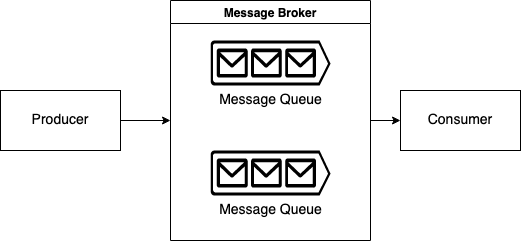
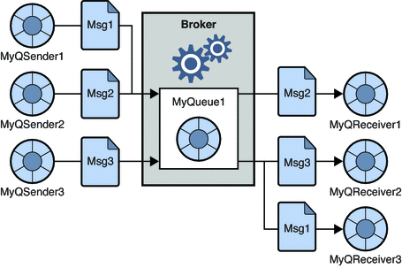
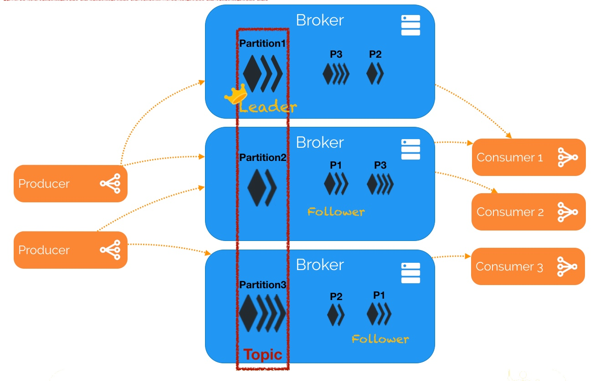
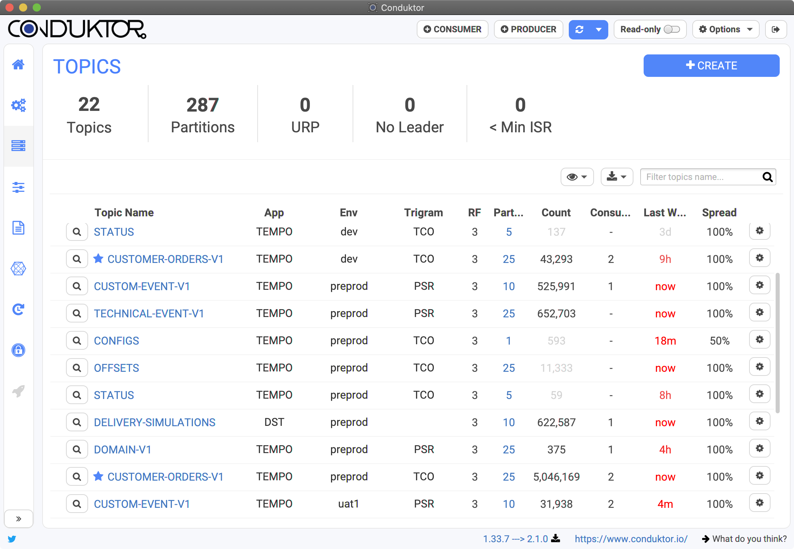
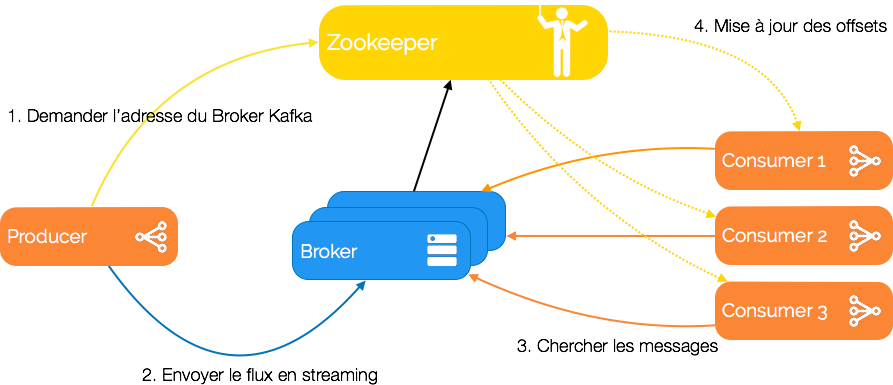
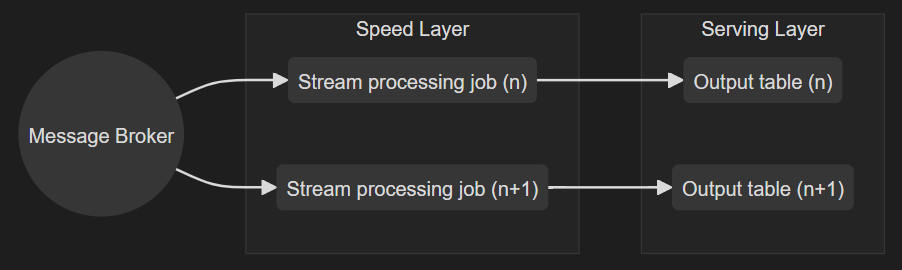
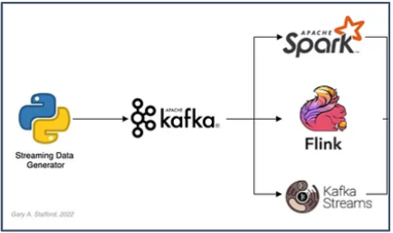
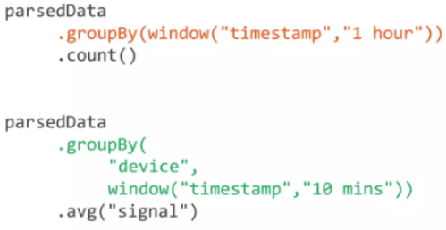
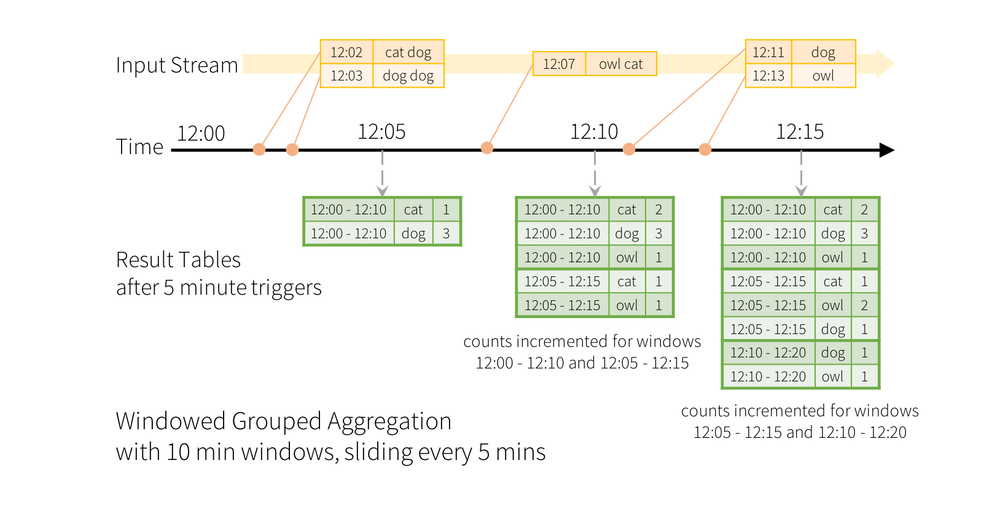

# Cours: Streaming

# 1. Messaging Systems
Les systèmes modernes génèrent et traitent des flux continus de données : transactions bancaires, activités sur les réseaux sociaux, capteurs IoT, ou encore logs d'applications. Pour gérer efficacement ces flux en temps réel, les systèmes de messagerie (messaging systems) jouent un rôle crucial.

### 1.1) Qu'est-ce qu'un système de messaging ?

Un système de messaging (_Messaging System_) permet l'échange de données entre applications via un mécanisme de communication asynchrone. 
Dans cette architecture:
- une application appelée "**producer**" génère et envoie des messages, qui sont ensuite acheminés
- via un "**broker**" (le gestionnaire central de messages) 
- vers une application "**consumer**" qui les consomme. Ex: une application Spark Streaming, un site web, un outil d'analyse etc... 
  
Le broker agit comme un intermédiaire fiable, stockant temporairement les messages dans des files d'attente (_queues_) avant leur livraison. 

Cette approche découplée (via l’intermédiation du broker) permet aux applications de se concentrer uniquement sur le traitement des données, sans avoir à gérer les complexités de la ***communication*** directe entre elles. 
En effet le producer et le consumer peuvent ainsi fonctionner de manière indépendante, à leur propre rythme, grâce à la nature asynchrone du système. De plus, fini le risque de perte de donnée si le récepteur (l'application qui reçoit les données) n'est pas disponible. 



>Attention: S'il est vrai que tout système de messaging s'appuie sur un message broker, tout message broker n'est pas système de messaging! 
>Ex de message broker: RabbitMQ, Apache ActiveMQ
>Ex de système de messaging: Apache  Kafka

### 1.2) Patrons de messageries: 
Les patrons de messageries définissent différentes façons d'acheminer les messages entre les applications. Ils répondent à des besoins différents selon que l'on souhaite une communication directe entre deux points ou une diffusion plus large de l'information.

#### 1.2.1) Systèmes de messagerie Point à Point (Fan-out)
Dans ce modèle, un message est envoyé par un producer à une file d'attente spécifique et ne peut être consommé que par un seul consumer. C'est comme un courrier postal : une fois qu'une lettre est récupérée par un destinataire, elle n'est plus disponible pour les autres. Ce patron est idéal pour des cas d'usage comme la répartition des tâches entre workers (traitement de commandes, calculs distribués) où chaque message ne doit être traité qu'une seule fois.



#### 1.2.2) Systèmes de messagerie Publish/Subscribe
Dans ce modèle (souvent appelé "pub/sub"), un producer publie des messages sur un "topic" (canal thématique) et tous les consumers abonnés à ce topic reçoivent une copie du message. C'est comparable à un réseau social où un post est visible par tous les followers. Ce patron est parfait pour la diffusion d'événements (mises à jour de prix, notifications, alertes) où plusieurs applications ont besoin de réagir à la même information.


# 2. Kafka

### 2.1) Introduction 
Apache Kafka est une **plateforme de streaming distribuée** qui permet de :
- Publier et consommer des flux de données (comparable à un ***système de messaging***)
- Stocker ces données de manière **durable et résiliente**
- Traiter les données en **temps réel** dès leur arrivée

Notions clés: 
- **Topic**: un topic Kafka peut être vu comme une catégorie ou un canal de données, qui est divisé en une ou plusieurs partitions. C'est l'unité logique de base.
- **Partition**: séquence ordonnée et immuable de messages. Chaque broker peut avoir zéro ou plusieurs partitions par topic
- **Répliques (Replicas)**:  backups d'une partition. Elles ne sont jamais lues ni modifiées par les acteurs externes, elles servent uniquement à prévenir la perte de données.
- **Leader**: Nœud unique responsable de gérer les lectures/écritures d'une partition. Kafka essaie automatiquement de distribuer les leaders de manière équitable entre les brokers pour éviter la surcharge d'un seul nœud.
- **Follower**: Nœuds qui répliquent les données du leader. Peuvent être promus leader si le leader actuel devient indisponible 

>Ex: Nous pouvons créer un topic 'sales' et partitionner les messages par région géographique 




Dans l'exemple ci-dessus, un topic est configuré en trois partitions. On a 2 producers, 3 consumers et 3 brokers et un facteur de réplication = 3 (car 3 répliques identiques de chaque partition Pi). Avec le noeud 1 qui est leader pour la Partition1.

NB: Quand un message est envoyé à un topic, il est en réalité stocké dans une de ses partitions
- Le choix de la partition peut être :
    - Aléatoire
    - Déterminé par une clé de partitionnement
    - Spécifié explicitement

Avantages du partitionnement :
- Parallélisme : plusieurs consommateurs peuvent lire différentes partitions simultanément
- Scalabilité : les données sont distribuées sur plusieurs brokers
- Haute disponibilité : les partitions peuvent être répliquées


Enfin, il est important de mentionner que Apache Kafka n'est pas doté d'une interface utilisateur intégrée. Cependant, il existe plusieurs outils tiers qui fournissent une interface utilisateur graphique (GUI) pour gérer, surveiller et interagir avec les clusters Kafka. Ces outils sont très populaires car ils simplifient le processus de visualisation des flux de données (data stream), la gestion des sujets, la surveillance des consommateurs et des producteurs, et même la résolution des problèmes. L'un des plus populaire est Conduktor.



### 2.2) Kafka & Zookeeper

Un cluster Kafka est composé de plusieurs brokers qui se répartissent la charge de travail. Ces brokers, bien que capables de gérer des centaines de milliers d'opérations par seconde et de stocker des téraoctets de données, sont stateless - ils ne maintiennent pas leur propre état.

C'est là qu'intervient ZooKeeper, un service centralisé qui assure la coordination du cluster. Il gère les configurations, maintient l'état des brokers et notifie les producteurs et consommateurs de tout changement dans le cluster (comme l'ajout d'un nouveau broker ou une panne).



>Nb: Kafka évoluant, les nouvelles versions abandonnent progressivement ZooKeeper au profit de KRaft (Kafka Raft), un protocole de consensus intégré qui permet une gestion autonome des métadonnées du cluster.


# 3. Stream data processing 

### 3.1) Introduction 

Le traitement de flux (stream processing) représente une approche moderne du traitement de données. Il permet d'analyser et traiter les données en **temps réel**, dès leur création ou réception, contrairement au traitement par lots (batch processing) qui opère sur des ensembles de données à intervalles réguliers.

Cette méthode est particulièrement précieuse lorsque la rapidité d'accès aux données est critique pour l'entreprise. Par exemple, pour la détection de fraudes bancaires, le monitoring d'équipements industriels ou l'analyse de comportements clients en temps réel.

Il constitue la couche "Speed Layer" dans l'architecture Lambda, et surtout est au cœur de l'architecture Kappa.




Alors que les message brokers (via Apache Kafka) assurent le transport fiable et le stockage temporaire des flux de données, des outils de traitement de flux comme Apache Spark streaming et Apache Flink se chargent d'analyser et de transformer ces flux de données en temps réel. 




### 3.2) comparaison Flink, Storm, Spark Streaming

Les 3 outils de traitement de flux à savoir sont: Flink, Storm et Spark Streaming. 
Voyons comment ils se distinguent et dans quel cas en privilégiez un plutôt qu'un autre. 

| Aspect                     | Apache Spark Streaming                                                   | Apache Flink                                                                                                       | Apache Storm                                          |
| -------------------------- | ------------------------------------------------------------------------ | ------------------------------------------------------------------------------------------------------------------ | ----------------------------------------------------- |
| **Description**            | Framework de traitement unifié (batch + streaming)                       | Moteur de traitement distribué orienté streaming natif                                                             | Framework de streaming open source                    |
| **Modèle de traitement**   | Micro-batch (par intervalles)                                            | Streaming natif (continu)                                                                                          | Streaming natif (continu)                             |
| **Latence**                | Quelques secondes                                                        | Quelques millisecondes                                                                                             | Quelques millisecondes                                |
| **Fenêtrage**              | Fenêtres temporelles et glissantes<br>                                   | Très flexible avec fenêtres personnalisables<br>*(fenêtres basées sur le temps, les événements ou personnalisées)* | Fenêtres basiques<br>*(fenêtres temporelles simples)* |
| **État applicatif**        | Stockage basé sur RDD en mémoire                                         | État géré nativement avec checkpoints                                                                              | Sans état par défaut, stockage externe nécessaire     |
| **Force principale**       | Polyvalence et écosystème riche                                          | Performance pure streaming                                                                                         | Simplicité et faible latence                          |
| **Machine Learning**       | MLlib intégré, écosystème mature                                         | FlinkML basique                                                                                                    | Limité, intégration externe nécessaire                |
| **Use cases**              | • Analytique temps réel<br>• ML à grande échelle<br>• Traitement hybride | • Streaming pur<br>• Complex Event Processing<br>• Analyse temps réel                                              | • Flux simples<br>• Cas d'usage temps réel basiques   |
| **Maturité/Support**       | Très mature, large communauté                                            | Mature, communauté croissante                                                                                      | Mature mais moins actif                               |
| **Facilité d'utilisation** | Moyenne à Simple                                                         | Complexe au début                                                                                                  | Simple                                                |
Retenez que: 
- Storm est historiquement le premier mais est moins utilisé dans les nouveaux projets
- Spark est souvent choisi pour sa polyvalence
- Flink est le choix privilégié pour du streaming pur avec des besoins complexes


### 3.3) Spark Streaming 

Apache Spark Streaming est un composant (API) de l'écosystème Apache Spark qui permet le traitement de données en temps réel. Cette extension du framework Spark permet aux développeurs de profiter des mêmes APIs (Spark Core, Spark SQL (DataFrame, DataSets), MLlib par exemple) que le traitement batch pour créer des applications de streaming, facilitant ainsi le développement d'applications temps réel à grande échelle.

#### 3.3.1) Architecture et Fonctionnement de Base
Le principe fondamental de Spark Streaming repose sur sa capacité à traiter les données en continu. Différents modes de traitement sont possibles. Ceux-ci définissent **comment** les données sont traitées. 

- Mode Batch: Bien que non considéré comme du "vrai" streaming, ce mode permet de traiter des données historiques en utilisant les mêmes APIs que le streaming. C'est particulièrement utile pour tester ou retraiter des données historiques.
  
- **Mode Micro-batch**: C'est l'approche par défaut de Spark Structured Streaming (appelation de la nouvelle API Spark pour le streaming). 
  Elle consiste à regrouper les données entrantes en petits lots traités à intervalles réguliers. Cette approche offre un bon compromis entre latence et débit, avec une garantie de traitement "exactly-once" (un enregistrement ne sera traité qu'une seule fois!), essentielle pour de nombreuses applications métier.
  
- **Mode Continu**: Introduit de manière expérimentale dans Spark 2.3, ce mode vise à réduire la latence en traitant chaque enregistrement dès son arrivée. Il offre une garantie "at-least-once", signifiant qu'un enregistrement sera traité au moins une fois, parfois plus.

#### 3.3.2) Interaction avec les Sources de Données
Spark Streaming propose plusieurs modes de lecture, particulièrement utiles lors de l'interaction avec des systèmes comme Apache Kafka :
- Le mode **Assign** permet un contrôle précis en spécifiant exactement quelles partitions lire
- Le mode **Subscribe** offre une approche plus flexible en s'abonnant à des topics spécifiques
- Le mode **SubscribePattern** permet une lecture en s'abonnant à des topics correspondant à un pattern spécifique
  
  Logique de lecture des stream de données: 


#### 3.3.3) Mode de déclenchement
Le traitement des données est contrôlé par différents modes de déclenchement (Trigger Modes). Ceux-ci définissent **quand** le traitement est déclenché. 

- Mode par **défaut**: Lance le traitement dès que le batch (lot) précédent est terminé
- Le mode **micro-lots à intervalles fixes**: Traite les données à intervalles de temps fixes (ex: toutes les 5 minutes). Les données s'accumulant entre les intervalles.
- Le mode **one-time**:  Traite toutes les données disponibles, puis s'arrête. (Utile pour des traitements ponctuels ou tests)
- Le mode **continu**: Spécifique au mode de traitement continu. Il vérifie constamment l'arrivée de nouvelles données à traiter

Ex de déclenchement à intervalle fixe = toutes les 1 seconde:


#### 3.3.4) Modes pour l'écriture en sortie
Spark Streaming dispose de trois modes pour écrire les résultats :

- Le mode **Complete** écrit l'intégralité des résultats à chaque fois, idéal pour des agrégations complètes.
  
- Le mode **Append**: Seules les nouvelles lignes ajoutées au tableau de résultats depuis le dernier déclenchement sont écrites dans le stockage externe. Idéal lorsqu'il n'est pas prévu que les lignes existantes du tableau de résultats soient modifiées.
   
- Le mode **Update**: Seules les lignes qui ont été mises à jour dans la table de résultats depuis le dernier déclenchement sont écrites dans le stockage externe. Et si ce sont de nouvelles elles sont append. 


##### 3.3.5 Fonctionnalités avancées de Spark Streaming

- **Les Types d'Opérations de Traitement**

	Dans Spark Streaming, nous distinguons deux grandes familles d'opérations qui répondent à des besoins différents : les opérations sans état et les opérations avec état.

	-Les Opérations **Sans État (Stateless)**:
	Ces opérations sont les plus simples à appréhender car elles traitent chaque enregistrement de manière isolée, sans tenir compte du contexte ou des données précédentes. Imaginez un filtre qui ne laisse passer que les transactions supérieures à 1000€, ou une transformation qui convertit chaque température de Celsius en Fahrenheit. Ces opérations (filter, map, flatMap, select, where) sont simples, rapides et faciles à paralléliser car elles ne nécessitent pas de maintenir un contexte entre les traitements.
	
	-Les Opérations **Avec État (Stateful)**
	À l'inverse, les opérations avec état maintiennent un contexte au fil du temps. Elles sont plus complexes mais aussi plus puissantes. Prenez l'exemple d'un compteur de visites par utilisateur : il doit se souvenir des visites précédentes pour incrémenter le compteur correctement. Ces opérations (agrégations, compteurs cumulatifs, moyennes mobiles, déduplication de données) nécessitent une gestion particulière de la mémoire et des mécanismes de checkpoint pour garantir la fiabilité du traitement.
	Ex: 
	


- **Les Jointures**

	Spark Streaming propose deux types de jointures qui enrichissent considérablement les possibilités de traitement.

	-Les Jointures **Stream-to-Stream**: permettent de combiner deux flux de données en temps réel. Imaginez un système qui doit associer des paiements avec des commandes en temps réel : les deux flux doivent être synchronisés et joints correctement. C'est une opération complexe qui nécessite de maintenir un état pour les données qui n'ont pas encore trouvé leur correspondance.
	
	-Les Jointures **Stream-to-Static**: sont plus simples car elles associent un flux avec des données statiques. Par exemple, enrichir un flux de transactions avec les informations clients stockées dans une base de données. Ces jointures sont généralement plus performantes car un côté de la jointure reste constant.

- **La Gestion du Temps et des Retards**

	La gestion du temps est cruciale dans le traitement en temps réel, et Spark Streaming propose des mécanismes sophistiqués pour la gérer.
	
	-**Le Watermarking**: c'est un concept fondamental répondant à une question critique: combien de temps devons-nous attendre les données retardataires ? 
	Il agit comme un garde-fou qui permet de :
	- Gérer proprement les données qui arrivent en retard
	- Libérer la mémoire des anciennes fenêtres devenues obsolètes
	- Maintenir la cohérence des résultats malgré les aléas du temps réel
	
	-**Le Fenêtrage Temporel (Windowing)**: complète le watermarking en permettant d'analyser les données par tranches de temps. Que ce soit avec des fenêtres fixes (tumbling), glissantes (sliding) ou basées sur l'activité (session), ce mécanisme permet des analyses temporelles précises et pertinentes.
		
	
	Prenons un exemple concret : imaginons un système de monitoring IoT qui reçoit des données de milliers de capteurs. Avec une fenêtre glissante de 5 minutes (pour appliquer notre agrégation) et un watermark de 10 minutes.
	Nous pouvons ainsi calculer des moyennes mobiles tout en gérant les capteurs qui envoient leurs données en retard :
	
	```python
	streamingDF
	  .withWatermark("timestamp", "10 minutes")
	  .groupBy(
	    window("timestamp", "5 minutes"),
	    "deviceId"
	  )
	  .agg(avg("temperature"))
	```


---

Sources:
- https://dataengineering.wiki/Concepts/Stream+Data+Processing
- https://insatunisia.github.io/TP-BigData/tp3/
- https://eda-visuals.boyney.io/visuals/message-queue-vs-event-broker
- https://blog.bytebytego.com/