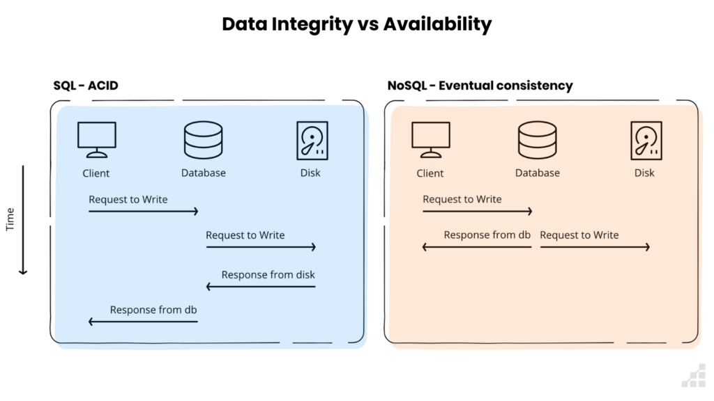
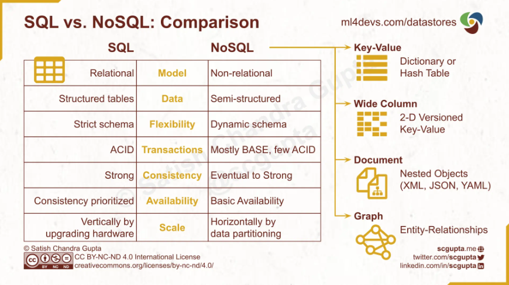
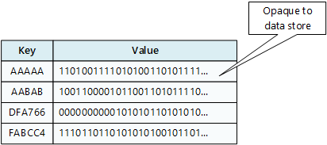
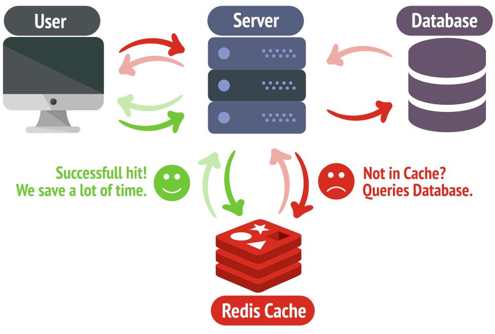
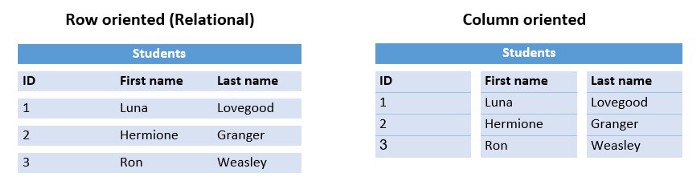
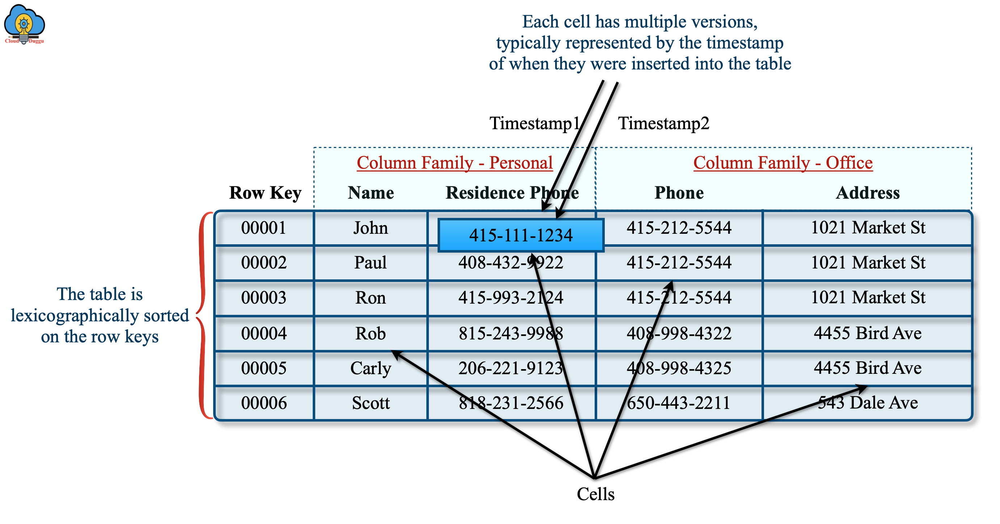
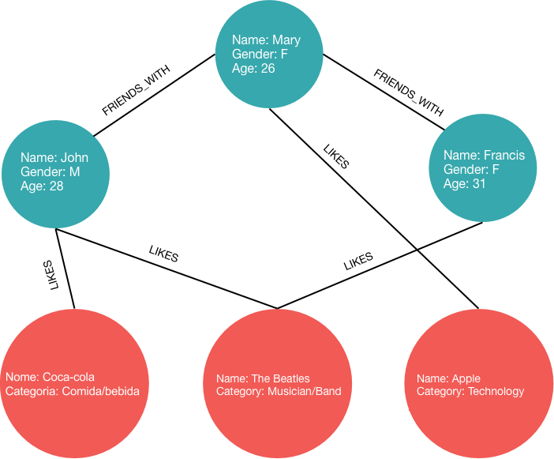
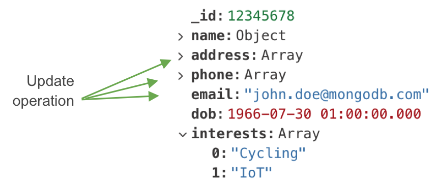
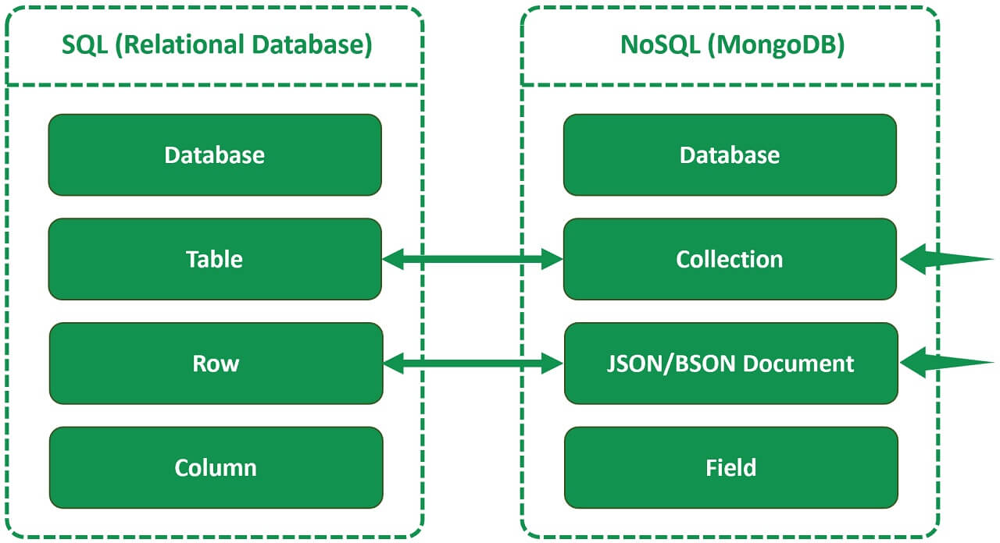

                                                                                             
# Cours : Introduction Aux Bases de données NoSQL


# 1. Introduction (15 min) 📌

### 1.1) Définition : 
NoSQL (Not Only SQL) désigne des bases de données non relationnelles. Ce sont des bases de données qui n'utilisent pas un schéma tabulaire de lignes et de colonnes. 
Elles utilisent plutôt un modèle de stockage optimisé pour le type spécifique de données stockées. 
Par exemple, les données peuvent être stockées sous la forme d'une paire clé/valeur, de JSON ou d'un graphe composé de nœuds et d'arêtes.

Ces systèmes sont conçus pour gérer des **données volumineuses, variées et évolutives**, en privilégiant la flexibilité et la performance plutôt qu'une structure rigide.

### 1.2) Emergence du NoSQL

Avec l'explosion de la quantité de données, et principalement les facteurs volume, vélocité et variété, de nouveaux systèmes de base de données sont nécessaires. On explorera ainsi d'autres schémas, d'autres architectures, d'autres logiques d'organisation de la donnée afin de répondre aux besoins croissants de stockage et traitement de la donnée. 
Les géants du web (Google, Amazon, Facebook) ont été les premiers à développer leurs propres solutions NoSQL pour répondre à leurs besoins spécifiques :
- Google : BigTable (2006, BDD orientée colonne) afin de stocker et analyser des pétaoctets de données des pages web qu'ils indexent. 
- Amazon : Dynamo (2007, clé-valeur) afin de garantir une disponibilité maximale du panier d'achat en cas de de forte charge (millions de sessions utilisateurs simultanées)
- Facebook : Cassandra (2008, BDD orientée colonne et distribuée) afin de gérer les posts, messages et events de centaines de millions d'utilisateurs. 
  
 Ces solutions ont progressivement été open-sourcées et adoptées par d'autres entreprises, donnant naissance à un **écosystème riche de bases NoSQL** adaptées à différents cas d'usage.
 
### 1.3) Pourquoi le NoSQL ? 

Bien que les bases de données relationnelles aient fait leurs preuves pendant des décennies, elles présentent plusieurs limitations face aux défis modernes du traitement des données :

- **Rigidité du schéma** : Les bases relationnelles imposent une structure fixe (schéma) qui doit être définie à l'avance. Imaginez un meuble avec des tiroirs de taille fixe : si vos données ne correspondent pas exactement à ces dimensions, vous avez un problème !
- **Scalabilité verticale limitée** : L'approche traditionnelle consiste à augmenter les ressources d'un seul serveur (plus de RAM, meilleur CPU...), mais cette approche a des limites physiques et devient très coûteuse.
- **Performances sous pression** : Face à de très grands volumes de données ou un nombre élevé d'utilisateurs simultanés, les bases relationnelles peuvent montrer des signes de ralentissement, notamment à cause des **jointures complexes** entre tables.
- **Inadaptation aux données non structurées** : Les données moderne (textes, images, capteurs IoT, réseaux sociaux...) ne rentrent pas naturellement dans le modèle relationnel.

### 1.4) NoSQL vs SQL 

Afin de comprendre les différences conceptuelles entre SQL et NoSQL, nous devons revoir quelques concepts de base. 

#### 1.4.1) **Le théorème CAP**: 
Énoncé par Eric Brewer en 2000, ce théorème est fondamental pour comprendre les compromis **dans les systèmes distribués**. Il affirme qu'un système distribué ne peut garantir simultanément que **deux** des trois propriétés suivantes :

- **Consistency (Cohérence)** : Tous les nœuds voient les mêmes données au même moment
- **Availability (Disponibilité)** : Chaque requête reçoit une réponse (succès ou échec)
- **Partition tolerance (Tolérance au partitionnement)** : Le système continue de fonctionner malgré la perte de communication entre les nœuds

#### 1.4.2) Des compromis aux modèles de cohérence (ACID vs BASE)
Face à ce théorème, **deux approches** de gestion de la cohérence des données ont émergé :
- **ACID** : modèle traditionnel privilégiant la **cohérence forte**
    - Utilisé principalement par les bases SQL
    - Garantit des propriétés strictes :
        - **Atomicity** (atomicité) : Transaction entièrement réussie ou annulée
        - **Consistency** (cohérence): État cohérent après chaque transaction
        - **Isolation** (isolation): Transactions isolées
        - **Durability** (persistence): Transactions permanentes une fois validées
    - Correspond à un choix **CA** dans le théorème CAP (fonctionne bien dans un environnement non distribué)
      
      Nb: une transaction est une série d'opérations qui doivent être exécutées comme une seule unité. Exemple classique : transfert bancaire (débiter compte A ET créditer compte B)
      
- **BASE** : modèle alternatif privilégiant la **disponibilité et la distribution**
    - Adopté par de nombreuses solutions NoSQL
    - Propose une approche plus souple :
        - **Basically Available** : Priorité à la disponibilité
        - **Soft state** : État temporairement incohérent accepté
        - **Eventually consistent** : Cohérence atteinte progressivement
    - Les solutions NoSQL choisissent ensuite entre :
        - **CP** : privilégient la cohérence (MongoDB, HBase)
        - **AP** : privilégient la disponibilité (Cassandra, CouchDB)

Ex:
- Applications nécessitant une **cohérence immédiate** (banque) → ACID
- Applications privilégiant la **disponibilité** (réseaux sociaux) → BASE


  


#### 1.4.3) SQL vs NoSQL



Contrairement à SQL, NoSQL (Not Only SQL, Non-SQL) est une base de données qui gère les données dans une structure non relationnelle. Cela signifie qu'elle n'a pas de schéma (pas de schéma fixe) et est peu recommandée pour des requêtes complexes (impliquant notamment des jointures)


Pourquoi ? Car les bases de données relationnelles (SQL) stockent les données dans plusieurs tables en essayant d'éliminer les informations en double. C'est ce qu'on appelle la [normalisation](https://en.wikipedia.org/wiki/Database_normalization).

Par exemple, disons que nous voulons stocker des données sur des livres et que chaque livre a un titre et un auteur. Dans une base de données relationnelle, nous aurions une table appelée livres qui comporterait 3 champs (id, titre, id_auteur) et une autre table appelée auteurs qui comporterait 2 champs (id, nom). Ainsi, lorsque vous souhaitez interroger la base de données et obtenir tous les livres écrits par un auteur spécifique, vous pouvez utiliser JOIN pour combiner les informations des deux tables en une seule requête, comme suit :
```sql
SELECT * FROM books
JOIN authors ON books.author_id = authors.id
WHERE authors.id = 1
```

En revanche, si nous devions utiliser une base de données NoSQL pour stocker ce type de données, nous devrions conserver des informations dupliquées afin de garder tous les livres dans une collection appelée livres. Chaque livre serait un objet JSON comme celui-ci :

```json
{
   id: 1,
   title: 'Clean Code',
   author: 'Robert C. Martin'
 },
 {
   id: 2,
   title: 'The Clean Coder',
   author: 'Robert C. Martin'
 },
...
```


# 2) Types de bases NoSQL : 


### 2.1) Clé-valeur: 
Modèle le plus simple du NoSQL, c'est un type de base de données qui stocke les données sous forme de tableau, avec une clé unique pour chaque valeur de données. La valeur étant **opaque** pour la base de données : elle ne "comprend" pas son contenu



| Avantages                                                                                                                                      | Inconvénients                                                                                                                                                                                                                   |
| ---------------------------------------------------------------------------------------------------------------------------------------------- | ------------------------------------------------------------------------------------------------------------------------------------------------------------------------------------------------------------------------------- |
| - Optimisé pour les recherches simples utilisant la clé ou une série de clés sur une table unique.<br><br>- Scale facilement (horizontalement) | - Pas très pratique si vous avez besoin d'interroger ou de filtrer par des valeurs autres que des clés.<br><br>- Souvent plus coûteuses que d'autres types de bases de données car elles ont tendance à fonctionner en mémoire. |


- Exemples populaire de bases de données clés/valeurs:
	- Redis, DynamoDB, Riak, IonDB 


Quand utiliser ? : 
Principalement lorsque vous devez mettre des données (ne nécessitant pas des requêtes complexes) **en cache**. (cache de données, sessions utilisateurs, files de messages, préférences utilisateurs etc...)




### 2.2) Document
Evolution du modèle clé-valeur, les base de données documentaires sont un type de base de données NoSQL conçues pour stocker et interroger des données sous la forme de documents de type JSON. Elles facilitent le stockage et l'interrogation des données d'une manière qui peut évoluer avec les besoins d'une application.


| Avantages                                                                                                                                                                                                                       | Inconvénients                                                                                                                                                                                                                                                                                                                                                                                                              |
| ------------------------------------------------------------------------------------------------------------------------------------------------------------------------------------------------------------------------------- | -------------------------------------------------------------------------------------------------------------------------------------------------------------------------------------------------------------------------------------------------------------------------------------------------------------------------------------------------------------------------------------------------------------------------- |
| - Créer des documents sans avoir à en définir la structure au préalable.<br><br>- Ajouter de nouveaux champs à la base de données sans modifier les champs des documents existants.<br><br>- Scale facilement (horizontalement) | - Les performances des requêtes peuvent être inférieures à celles d'une base de données relationnelle, car les données ne sont pas nécessairement structurées ou organisées pour les requêtes.<br><br>- L'interrogation (querying) nécessite généralement des connaissances plus techniques.<br><br>- La mise à jour des données peut être longue car les données peuvent être réparties entre les machines et dupliquées. |

- Exemples populaire de bases de données clés/valeurs:
	- MongoDB, Couchbase, Azure Cosmos DB, RavenDB, ElasticSearch 


Quand utiliser ? : 
Principalement lorsque vous devez stocker le contenu d'articles, des messages/posts de réseaux sociaux, des catalogues d'articles, des données de capteurs et d'autres données non structurées. Ou encore, lorsque vous devez développer et itérer rapidement lors de la construction d'un produit.


### 2.3) Orienté colonnes
Comme son nom l'indique, ce sont des bases de données qui stockent les données par colonnes plutôt que par lignes, permettant un accès et une agrégation efficaces de grandes quantités de données similaires.








| Avantages                                                                                                                                                                                                                                      | Inconvénients                                                                                                                                                                                                        |
| ---------------------------------------------------------------------------------------------------------------------------------------------------------------------------------------------------------------------------------------------- | -------------------------------------------------------------------------------------------------------------------------------------------------------------------------------------------------------------------- |
| - Lecture rapide de colonnes spécifiques pour les agrégations car n'inclue pas des colonnes inutiles.<br><br>- Compression efficace: Les données similaires stockées ensemble se compressent mieux<br><br>- Scale facilement (horizontalement) | - Plus lentes que les bases row-oriented pour les insertions<br><br>- Architecture plus complexe, moins intuitive pour les développeurs<br><br>- Latence: Moins adaptée aux requêtes temps réel et transactions OLTP |

- Exemples populaire de bases de données clés/valeurs:
	- Cassandra, HBase, ScyllaDB, Google BigTable


Quand utiliser ? : 
Principalement pour du datawarehousing, big data analytics ou encore de la BI (business intelligence)


### 2.4) Graph
Type de base de données qui utilisent des nœuds, des arêtes et des propriétés pour stocker des données sur les entités et les relations entre elles. L'objectif principal d'une base de données de graphes est de permettre de parcourir efficacement le réseau de nœuds et d'arêtes, et d'analyser les relations entre les entités.





| Avantages                                                                                                                                                                                                                                                    | Inconvénients                                                                                                                                                                                                                                                                                    |
| ------------------------------------------------------------------------------------------------------------------------------------------------------------------------------------------------------------------------------------------------------------ | ------------------------------------------------------------------------------------------------------------------------------------------------------------------------------------------------------------------------------------------------------------------------------------------------ |
| - Assez performant pour traverser/parcourir des relations complexes<br><br>- Représentation naturelle des données connectées (réseaux sociaux, connaissances)<br><br>- Facile d'ajouter de nouveaux types de relations sans modifier la structure existante. | - Scalabilité: Distribution plus complexe que d'autres bases NoSQL car les données sont fortement interconnectées<br><br>- Consommation importante de mémoire pour maintenir les index de relations<br><br>- **Courbe d'apprentissage** : Nécessite d'apprendre de nouveaux langages de requête. |

- Exemples populaire de bases de données clés/valeurs:
	- Neo4j, ArangoDB, Amazon Neptune, OrientDB


Quand utiliser ? : 
Idéal pour de l'analyse de réseaux sociaux, graphes de connaissances, détection de fraude, système de navigation, routage, analyse de traffic ou d'impact et dépendances. 


### 3) Zoom sur MongoDB 

#### 3.1) Introduction 
MongoDB a été créé en 2007 par la société 10gen (maintenant MongoDB Inc.) alors qu'ils travaillaient sur une plateforme PaaS (Platform as a Service). Face aux limitations des bases SQL traditionnelles pour gérer des données web à grande échelle, ils ont décidé de se concentrer sur le développement d'une nouvelle base de données.

**Caractéristiques :** 
- Haute performance pour les lectures/écritures
- Scalabilité horizontale native
- Flexibilité du schéma pour le développement agile
- Support natif des données type JSON pour faciliter le développement web

**Évolution clés :** 
- 2009 : Première version open-source
- 2012 : Devient la base NoSQL la plus populaire
- 2017 : Introduction de multi-document ACID transactions
- 2019 : MongoDB Atlas (DBaaS) devient le produit principal
- 

						- *multi-document ACID transactions* - 

**Vocabulaire :**




#### 3.2) Concepts clés

**Formats JSON & BSON :**
- JSON (JavaScript Object Notation):
	- Format lisible par l'humain
	- Structure simple : clés-valeurs, tableaux, objets imbriqués

```json
{
  "name": "John",
  "age": 30,
  "address": {
    "street": "123 Main St",
    "city": "Paris"
  },
  "hobbies": ["reading", "sports"]
}
```

**BSON (for Binary JSON) :**
- Format binaire utilisé par MongoDB en interne
- Avantages par rapport au JSON :
    - Plus performant (parsing/stockage)
    - Types de données additionnels : Date, ObjectId, Binary, Decimal128
    - Préserve l'ordre des champs
    - **Support des données binaires**


**Types de données :**
    - `String`, `Number` (Integer, Float, Decimal128)
    - `Date`, `Boolean`, `Null`
    - `ObjectId` (identifiant unique automatique)
    - `Array`, `Object` (document imbriqué)

**Bonnes pratiques :**
>- Limiter la profondeur d'imbrication (2-3 niveaux max)
>- Document size limit à avoir en tête: 16MB
>- Utiliser des types cohérents pour un même champ
>- Éviter les noms de champs avec des points ou dollars
>- Contrôler la dénormalisation pour optimiser vos lectures de données
>- Éviter la sur-indexation (car même si gain lecture, gros impact au niveau de l'écriture)


**Usages typiques**
- Applications web modernes
- Applications mobiles
- Gestion de contenu
- Analyse en temps réel
- IoT et Big Data


---
# Mini-TP MongoDB : Opérations CRUD
Durée estimée : 20-30 minutes


## Préparation
1. Ouvrir https://mongoplayground.net/
2. Copier le code suivant dans la section "Dataset" pour initialiser les données :

```javascript
db = {
  etudiants: [
    {
      _id: 1,
      nom: "Dubois",
      prenom: "Marie",
      age: 22,
      specialite: "Big Data",
      notes: [
        { matiere: "Python", note: 15 },
        { matiere: "NoSQL", note: 17 }
      ]
    },
    {
      _id: 2,
      nom: "Martin",
      prenom: "Lucas",
      age: 23,
      specialite: "IA",
      notes: [
        { matiere: "Python", note: 16 },
        { matiere: "NoSQL", note: 14 }
      ]
    }
  ]
}
```

## Partie 1 : Lecture (READ)
### Exercice 1.1 : Lecture simple
Afficher tous les étudiants :
```javascript
db.etudiants.find({})
```

### Exercice 1.2 : Filtrage
Trouver l'étudiant qui s'appelle "Marie" :
```javascript
db.etudiants.find({ prenom: "Marie" })
```

### Exercice 1.3 : Projection
Afficher uniquement les noms et prénoms des étudiants :
```javascript
db.etudiants.find({}, { nom: 1, prenom: 1, _id: 0 })
```

## Partie 2 : Création (CREATE)
### Exercice 2.1 : Insérer un nouvel étudiant
```javascript
db.etudiants.insert({
  _id: 3,
  nom: "Bernard",
  prenom: "Thomas",
  age: 21,
  specialite: "Big Data",
  notes: [
    { matiere: "Python", note: 13 },
    { matiere: "NoSQL", note: 15 }
  ]
})
```

## Partie 3 : Mise à jour (UPDATE)
### Exercice 3.1 : Modifier un document
Ajouter une note à Marie :
```javascript
db.etudiants.update(
  { prenom: "Marie" },
  { 
    $push: { 
      notes: { matiere: "Java", note: 16 } 
    }
  }
)
```

### Exercice 3.2 : Modifier plusieurs documents
Augmenter l'âge de tous les étudiants de 1 an :
```javascript
db.etudiants.update(
  {},
  { $inc: { age: 1 } },
  { multi: true }
)
```

## Partie 4 : Suppression (DELETE)
### Exercice 4.1 : Supprimer un document
Supprimer l'étudiant qui s'appelle Thomas :
```javascript
db.etudiants.remove({ prenom: "Thomas" })
```

## Exercices supplémentaires

### 1. Requêtes avancées
Trouver les étudiants ayant eu plus de 15 en NoSQL :
```javascript
db.etudiants.find({
  "notes": {
    $elemMatch: {
      "matiere": "NoSQL",
      "note": { $gt: 15 }
    }
  }
})
```

### 2. Agrégation simple
Calculer la moyenne d'âge des étudiants :
```javascript
db.etudiants.aggregate([
  {
    $group: {
      _id: null,
      moyenneAge: { $avg: "$age" }
    }
  }
])
```

## À vous de jouer !

Exercices à essayer :
1. Trouvez tous les étudiants en spécialité "Big Data"
2. Calculez la moyenne en Python 
3. Ajoutez un nouvel étudiant avec vos propres données
4. Modifiez la spécialité d'un étudiant existant


---
Sources:
- https://data-flair.training/blogs/sql-vs-nosql/
- https://dataengineering.wiki/Concepts/Non-relational+Database
- https://www.scalablepath.com/back-end/sql-vs-nosql
- https://nodeflair.com/blog/sql-vs-nosql-databases-system-design-interview