# Cours : DevOps

### Objectifs pédagogiques :
1. Comprendre les principes du DevOps appliqués au Data Engineering.
2. Comprendre comment fonctionnent les pipelines de données automatisés avec des outils DevOps.
3. Explorer des outils comme Jenkins, Azure DevOps et l’utilisation de fichiers YAML pour l’automatisation des processus.


# 1. Introduction DevOps 

### 1.1) Définition :
**Dev + Ops** → DevOps :  
  - Le DevOps vise à améliorer la collaboration entre les équipes de:
	  -développement (Dev) et 
	  -d'exploitation (Ops).  


  >Objectif : Automatiser les processus pour améliorer la **vitesse** de développement, la **qualité** des déploiements, et la **gestion** des infrastructures.

**Principes clés du DevOps** :  
  - **Collaboration** : Développement et opérations travaillent ensemble pour réduire les silos.  
  - **Automatisation** : Tests, déploiements, et gestion des infrastructures sont automatisés pour plus de rapidité et moins d'erreurs.
  - **Infrastructure as Code (IaC)** : Gérer l’infrastructure avec des fichiers de configuration (ex. Terraform, Ansible, Kubernetes).
  - **CI/CD** : Intégration continue (CI) et déploiement continu (CD) pour assurer une livraison rapide et fiable du code.

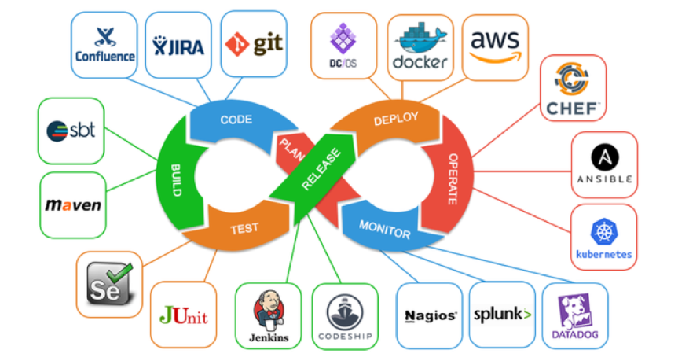

### 1.2) DevOps dans le cadre du Big Data :  
La pratique DevOps dans ce contexte consiste à automatiser les processus permettant de délivrer des solutions Big Data. De manière générale vos solutions s'appuieront sur un ensembles de repositories/dépôts, de librairies, d'APIs et d'instances de base de données (SQL ou NoSQL) qui permettent d'extraire, traiter/transformer, charger et servir la donnée aux utilisateurs finaux. 

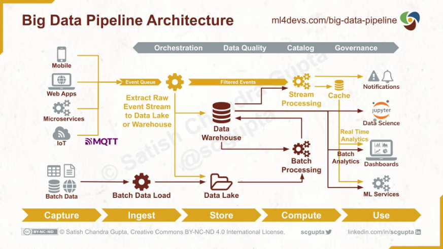

L'intérêt est de faciliter l'intégration en continue de nouvelles fonctionnalités à l'existant, mais aussi d'assurer le déploiement des nouvelles versions tout en évitant une interruption de service pour les utilisateurs. (services BI, AI/ML ou autres consommateurs finaux de nos données/pipelines de données).


# 2. Intégration Continue (CI)

L'intégration continue est une pratique fondamentale du DevOps qui vise à **automatiser la vérification de la qualité du code à chaque modification**. Elle permet de détecter rapidement les problèmes et d'assurer une **base de code stable et maintenable**.
Cette pratique s'appuie sur l'ensemble de concepts et d'étapes suivants: 

### 2.1) Versioning de code

C'est **la pratique de suivre et de gérer les modifications apportées au code source** d'un projet informatique au fil du temps.  

Bénéfices d’utiliser une solution qui permet de versionner son projet : 
- Tracer l'évolution du projet (historique des commits).
- Une meilleure collaboration avec d'autres développeurs (push/pull de version sur un repértoire)
- Revenir à des versions antérieures en cas de problèmes.

**Notions clés autour du versioning :**
- **branches :** élément fondamental et clé. Chaque version de mon projet évolue sur ce qu’on appelle une branche.  C’est une copie isolée de mon projet qui permet de travailler sur de nouvelles fonctionnalités/correctifs sans impacter les autres versions. 
  La branche par défaut sur git s’appelle “master”, c’est celle créée lorsqu’on exécute la commande “git init” dans un répertoire (afin de tracer l’évolution de mon répertoire projet).


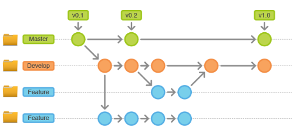


- **commit :** c'est une sauvegarde des modifications apportées au code. Une sorte de **photo/snapshot à un instant t de l’ensemble des fichiers de mon projet présent dans la zone de staging** qui sont placé dans la zone "repository". 
  Chaque commit a un message qui explique les changements effectués.

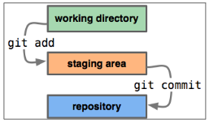


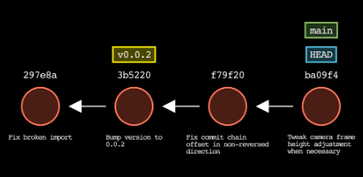

- **merge et pull request**: 
	- La fusion (ou merge) est le processus de fusion des modifications d'une branche dans une autre, souvent pour intégrer de nouvelles fonctionnalités. 
	- La pull request est une demande de merge qui intervient lorsqu’on souhaite fusionner ses modifications sur une branche “critique” qui nécessite la revue et l’approbation de vos collègues.**


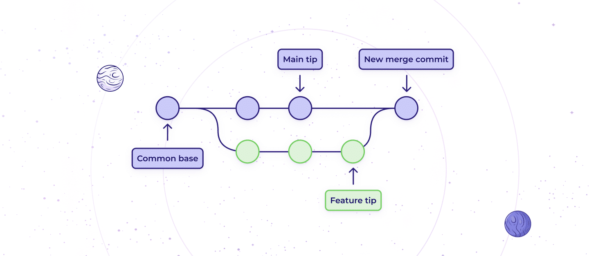

- **repository/dépôt :**** Un "repository" ("repo" en abrégé - anglicisme) est un **espace de stockage qui contient l'historique des fichiers, dossiers et code source d'un projet** logiciel. On distingue deux types de repo "local" VS "distant" (or remote)


Exemple de repository distant: Github, Gitlab, Bitbucket, Azure DevOps

### 2.2) Linting
Le linting est l'analyse (statique) automatique du code source pour détecter les erreurs de programmation, les erreurs de compilations, les bugs potentiels, les variables non utilisées et les violations des conventions de codage. Cette analyse est effectuée avant exécution du programme développé.

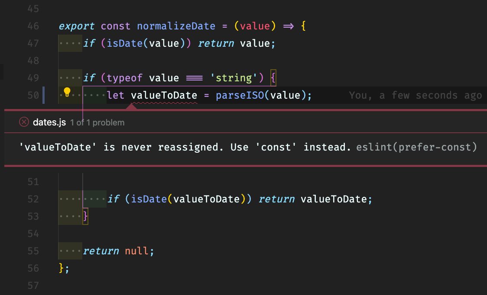

Linter populaires: 
- Python: pylint, flake8
- SQL: sqlfluff
- Javascript: ESLint


### 2.3) Tests Automatisés

Les tests souvent négligés sont indispensables pour s’assurer du bon fonctionnement du code, mais de manière plus large de la solution informatique développée. Dans le cas de l'intégration continue, où l'on rajoute principalement du code au code source de la solution existante, les principaux tests sont les **tests unitaires**. 
Tests ayant pour objectif de vérifier le bon fonctionnement d'une unité de code isolée, telle qu'une fonction ou une méthode. Ils sont utilisés pour s'assurer que chaque composant individuel fonctionne correctement.  
  
Quelques solutions pour vous accompagner dans vos tests :
- Python: Pytest
- Javascript: Mocha
- Java: Junit


>NB: Il y a un volet que je n'ai pas mentionné mais qui fait partie des bonnes pratiques d'intégration continue, à savoir: la documentation ! 
  Elle fait partie intégrante du cycle de développement et doit être traitée comme du code, maintenue et testée automatiquement, afin de suivre les évolutions de code source. 


### 2.4) Automatisation via des pipelines 

L'automatisation des étapes que l'on vient de voir se fait via ce qu'on appelle des pipelines. 
Un pipeline CI est une suite automatisée d'étapes qui s'exécute à chaque modification du code pour garantir sa qualité et son intégrabilité. 


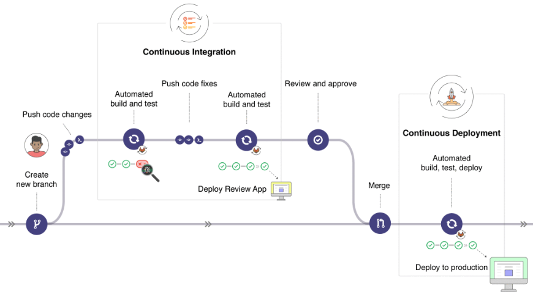


**Structure d'un pipeline :**
- Le déclencheur/trigger: (déterminé par l'équipe de dev/lead dev)
	- Push sur une branche ('develop' par exemple)
	- Création d'une PR (Pull Request)
	- Planification (tâches cron devant se lancer à une heure précise, ex: build de nuit)
	- Déclenchement manuel 

Une fois trigger, la pipeline s'appuie sur un fichier de configuration (.yaml) pour déterminer l'ensemble des étapes à effectuer :

```yaml
# Exemple de pipeline CI complet
name: Data Pipeline CI
on: [push, pull_request]

jobs:
  quality:
    runs-on: ubuntu-latest
    steps:
      # 1. Versioning
      - name: Checkout Code
        uses: actions/checkout@v2
        with:
          fetch-depth: 0  # Pour l'historique complet

      # 2. Environnement
      - name: Setup Python
        uses: actions/setup-python@v2
        with:
          python-version: '3.9'
          
      # 3. Dépendances
      - name: Install Dependencies
        run: |
          python -m pip install --upgrade pip
          pip install -r requirements.txt
          pip install pylint pytest pytest-cov black
          
      # 4. Linting et Formatage
      - name: Code Style Check
        run: |
          black --check src/
          pylint src/ --fail-under=8
          
      # 5. Tests
      - name: Run Tests
        run: |
          pytest --cov=src tests/
          
      # 6. Analyse de Qualité
      - name: SonarQube Analysis
        uses: sonarsource/sonarqube-scan-action@master
        env:
          SONAR_TOKEN: ${{ secrets.SONAR_TOKEN }}
          
      # 7. Documentation
      - name: Generate Documentation
        run: |
          sphinx-build -b html docs/ docs/_build/
```

En fonction de la solution d'orchestration utilisée, il sera placé soit dans un répertoire /workflows (Github), soit à la racine du projet (comme sur Gitlab ou Azure DevOps). 
L'interface de ces solutions vous permettent de tester votre pipeline avant de l'orchestrer, ou de la planifier. 


# 3. Déploiement Continue (CD)

Le Déploiement Continu (CD) représente l'**automatisation de la mise en production du code validé par la CI**. Cette pratique vise à :
- Réduire le temps entre le développement et la production
- Minimiser les erreurs humaines lors des déploiements
- Standardiser les processus de release
- Permettre des rollbacks rapides en cas de problème

### 3.1) Fondamentaux du CD
En pratique, la pipeline CD tout comme la pipeline se déclenche suite à un trigger spécifique. Mais généralement, l'une des conditions est le succès du pipeline CI. 
> if CI status == OK => then Launch Pipeline CD

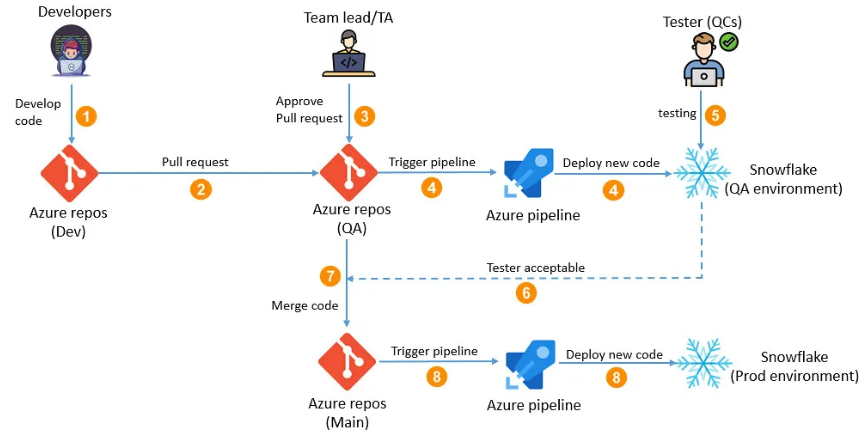

#### 3.1.1) Pipeline de déploiement

**Le Build**: 
Le Build intervient après la validation CI et avant le déploiement. Cette étape critique transforme le code validé en artefacts déployables. Cette transformation comprend:
- La compilation du code source en binaires exécutables
- L'empaquetage des dépendances nécessaires
- La création d'images Docker ou autres formats de conteneurs
- La génération des fichiers de configuration spécifiques à chaque environnement
>Nb: Dans certaines organisations, le build peut intervenir au moment de la CI. Mais il est préférable de la faire intervenir au moment du CD (déploiement) afin de s'assurer de build une version "stable" qu'on veut déployer. Par conséquent on réduit le nombre de build.

**Tests**: 
Une fois les artefacts construits, le pipeline exécute une série de tests dans des environnements isolés. Un ensemble de tests dont l'objectif est de vérifier la bonne intégration de la nouvelle version à l'existant. 
Dans cette phase (CD) on distingue principalement 2 types de tests: 
- **Tests d'intégration :** Les tests d'intégration vérifient la manière dont les différents composants du système interagissent les uns avec les autres.  
- **Tests de non-régression :** S'assurent que les nouvelles modifications ne cassent pas les fonctionnalités existantes.
D'autres tests peuvent être rajouté: tests de performance, sécurité etc...

#### 3.1.2) **Environnements de déploiement**
Une fois la phase de tests validée, il y a le déploiement dans le bon environnement d'exécution pour notre solution applicative. L'on distingue alors les 3 environnements suivants:

| Environnement              | Description                                                              | Caractéristiques                                                                                                                 | Objectifs                                                                                               |
| -------------------------- | ------------------------------------------------------------------------ | -------------------------------------------------------------------------------------------------------------------------------- | ------------------------------------------------------------------------------------------------------- |
| Développement 👨‍💻        | Premier niveau de test où les développeurs vérifient leurs modifications | • Environnement léger et flexible<br>• Configuration simplifiée<br>• Données de test<br>• Intégration avec IDE                   | • Tests unitaires<br>• Débogage<br>• Validation fonctionnelle<br>• Intégration continue                 |
| Staging/Pré-production 🛠️ | Réplique de la production pour validation finale                         | • Architecture identique à la prod<br>• Données (quasi-)similaire à la prod<br>• Configurations similaires<br>• Isolation réseau | • Tests d'intégration<br>• Tests de performance<br>• Validation des déploiements<br>• Tests de sécurité |
| Production 🏗️             | Environnement final utilisé par les clients                              | • Haute disponibilité<br>• Sécurité renforcée<br>• Scalabilité automatique<br>• Monitoring avancé                                | • Service client<br>• Performance optimale<br>• Sécurité maximale<br>• Disponibilité 24/7               |

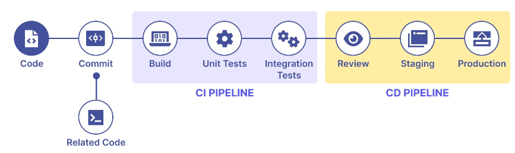

#### 3.1.3) Stratégies de déploiement en production
Lorsqu'il s'agit de déployer du code et des applications en production, voici les stratégies de déploiement les plus courantes : 

**- Blue-Green Deployment :**
- Deux environnements identiques (Blue/Green)
- Bascule instantanée
- Rollback immédiat possible
  >En pratique, le plus répandue dans l'industrie. (Dev -> Stg -> Prod)
  
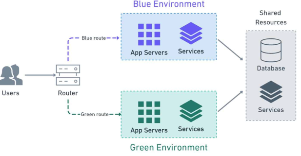

**-Canary release :**
- Déploiement progressif
- % croissant d'utilisateurs
- Détection précoce des problèmes

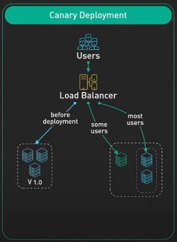

**-Rolling update :**
- Mise à jour progressive des instances
- Zero downtime
- Ressources optimisées


Exemple de fichier de configuration yaml (Azure DevOps):

```yaml
# azure-pipelines.yml
variables:
  - group: deployment-config  # Variable group définie dans Azure DevOps

stages:
- stage: Dev
  variables:
    environment: dev
  jobs:
  - deployment: Deploy
    environment: development
    pool:
      vmImage: 'ubuntu-latest'
    strategy:
      runOnce:
        deploy:
          steps:
          - task: AzureWebApp@1
            inputs:
              azureSubscription: '$(AZURE_SUBSCRIPTION)'
              appName: '$(APP_NAME)-dev'
              resourceGroupName: '$(RG_NAME)-dev'
              deployToSlotOrASE: true
              slotName: 'development'

- stage: Staging
  variables:
    environment: staging
  jobs:
  - deployment: Deploy
    environment: staging
    pool:
      vmImage: 'ubuntu-latest'
    strategy:
      runOnce:
        deploy:
          steps:
          - task: AzureWebApp@1
            inputs:
              azureSubscription: '$(AZURE_SUBSCRIPTION)'
              appName: '$(APP_NAME)-staging'
              resourceGroupName: '$(RG_NAME)-staging'

- stage: Production
  variables:
    environment: prod
  jobs:
  - deployment: Deploy
    environment: production
    pool:
      vmImage: 'ubuntu-latest'
    strategy:
      runOnce:
        deploy:
          steps:
          - task: AzureWebApp@1
            inputs:
              azureSubscription: '$(AZURE_SUBSCRIPTION)'
              appName: '$(APP_NAME)-prod'
              resourceGroupName: '$(RG_NAME)-prod'
```


#### Conclusion:
- L'intégration et le déploiement continus (CI/CD) sont une méthodologie et pratique. Ce n'est pas un outil.
- Un pipeline d'intégration et de déploiement continus (CI/CD) est une série d'étapes à réaliser pour livrer une nouvelle version d'un logiciel.  
- Le processus est automatisé de sorte que si des bogues sont découverts entre-temps, ils seront automatiquement détectés et résolus rapidement avant la mise en production.


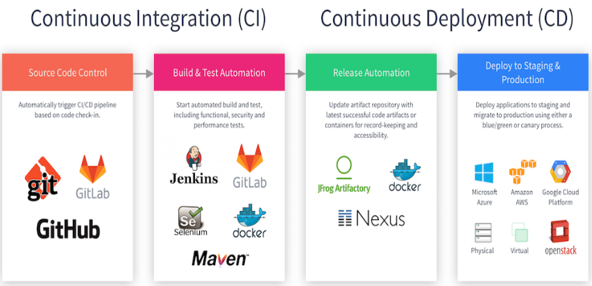


En pratique dans un contexte cloud:

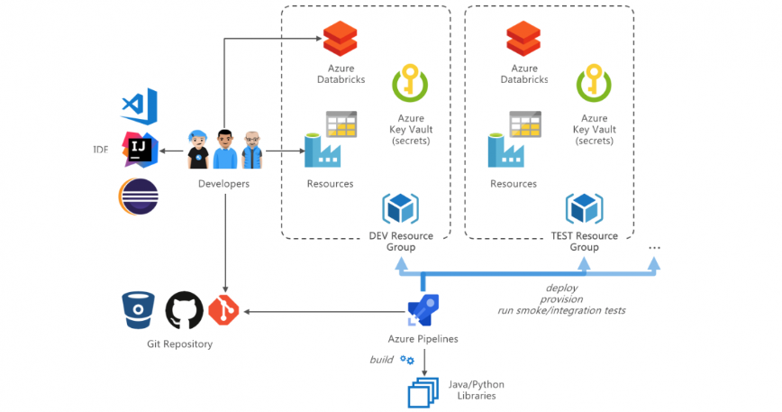


---
Sources: 
- https://harshityadav95.medium.com/notes-top-5
- https://learn.microsoft.com/en-us/azure/devops/
